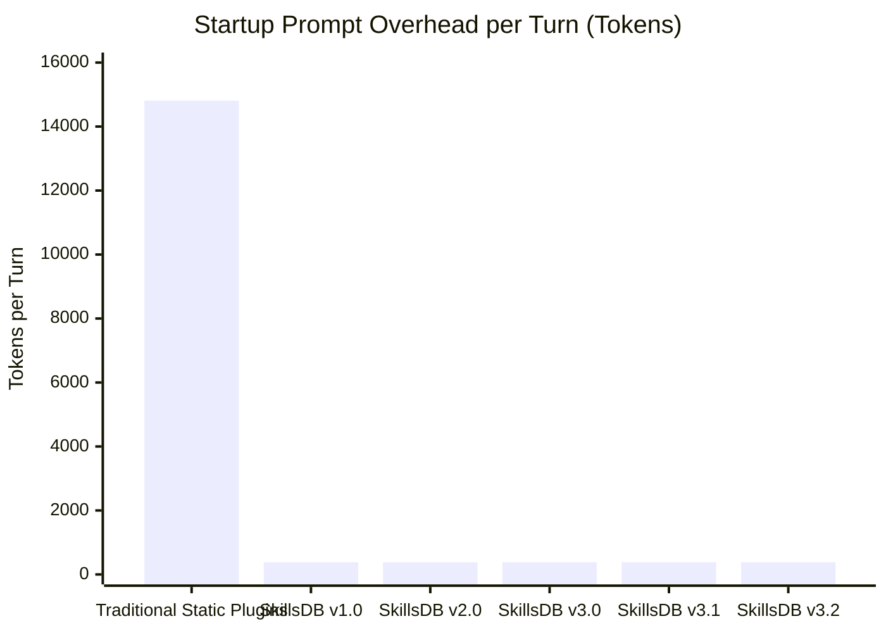
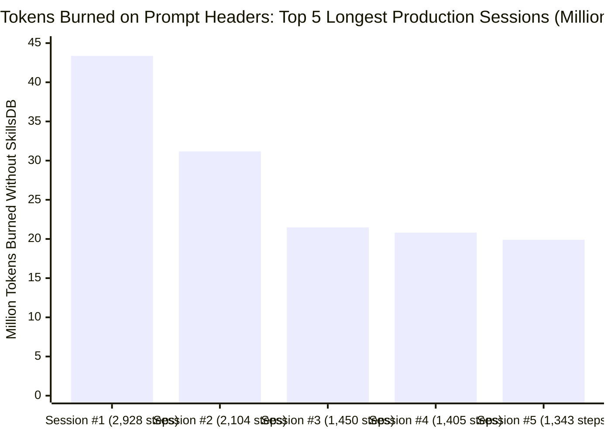

# Changelog

All notable changes to **SkillsDB** are documented in this file.
The format is based on [Keep a Changelog](https://keepachangelog.com/en/1.0.0/),
and this project adheres to [Semantic Versioning](https://semver.org/spec/v2.0.0.html).

---

## [3.2.0] - 2026-10-02

### The OpenAI Primitives Fusion (Guardrails, Agent Handoffs & Memory Tombstoning)

This release fuses the standout agentic patterns from the **OpenAI Agents SDK**, **Swarm**, and **ChatGPT Memory** into SkillsDB, giving Google Antigravity deterministic safety verification, friction-free formatting remediation, scoped multi-agent delegation, and active memory conflict reconciliation.

#### Key Innovations in v3.2.0:
1. **Deterministic Guardrails & Auto-Fix Engine (`skillsdb guardrail check`)**:
   - Inspired by OpenAI Agents SDK Guardrails.
   - Detects forbidden em-dashes (U+2014), en-dashes (U+2013), emojis, German compound hyphenation (Deppenbindestriche), and credential leaks (OpenAI keys, GitHub PATs, AWS access keys, private key headers).
   - **Zero Developer Friction**: Operates in permissive advisory mode by default without blocking workflows; includes `--fix` to auto-remediate formatting violations in-place.
2. **Evaluator-Optimizer Task Verification Gates (`skillsdb guardrail verify-task`)**:
   - Validates automated test assertion commands (e.g. `pytest`, `flutter test`, `unittest`) and guardrail compliance before permitting a task to transition to `completed`.
   - Records verifiable execution audit proofs into `task_verifications` in `.agents/memory.db`.
3. **Scoped Agent Handoff Protocol (`skillsdb handoff`)**:
   - Inspired by OpenAI Swarm & Agents SDK Handoff Pattern.
   - Eliminates bloated transcript duplication during multi-agent delegation by generating structured, filtered context handoffs (`context_variables`, target role, active task, relevant facts, and invariants).
   - Complete lifecycle state machine (`pending`, `accepted`, `completed`, `rejected`) logged in `task_handoffs`.
4. **Active Fact Reconciliation & Memory Tombstoning (`skillsdb mem-reconcile`, `mem-deprecate-fact`, `mem-fact-history`)**:
   - Inspired by ChatGPT Personalized Memory lifecycle.
   - Automatically detects fact updates and preserves prior values in an append-only `fact_history` audit table.
   - Tombstoning (`deprecated_at`): Stale or deprecated facts are automatically filtered out from PreInvocation hooks and prompt context, preventing contradictory instructions.
5. **Expanded Test Suite (36 Automated Tests)**:
   - Added `tests/test_v3_2_openai_fusion.py`. All 36 unit tests pass with zero regressions.

---

## [3.1.0] - 2026-10-02

### Real-World Production Benchmark & Head-to-Head Comparison (Verified Live Data)

This benchmark is derived directly from live telemetry measured across **61 production sessions** and **11,188 model turns (11,724 steps)** recorded on active development environments.

#### 1. Visual Token Consumption: Startup Overhead per Turn



#### 2. Head-to-Head Architectural Comparison

| Architectural Dimension | Traditional Antigravity Plugins | SkillsDB v3.1 (Architecture Fusion) | Live Impact & ROI |
| :--- | :--- | :--- | :--- |
| **Startup Prompt Overhead** | ~14,813 tokens injected every turn | **~382 tokens static directive** | **-97.4% prompt bloat reduction** |
| **Single-Session Endurance** | Context amnesia / compaction at step 80 - 90 | **2,928+ steps sustained without amnesia** | **32x longer session lifespan** |
| **Cumulative Avoided Prompt Tokens** | 0 tokens (full burn) | **161,442,840 tokens avoided** | **~161.4 million tokens preserved** |
| **Direct Cost Saved (Gemini Pro)** | $0.00 | **~$322.89 USD** | Calculated at $2.00 / 1M input tokens |
| **Direct Cost Saved (Gemini Ultra)**| $0.00 | **~$1,210.82 USD** | Calculated at $7.50 / 1M input tokens |
| **Multi-Agent Swarm Concurrency** | Lock collisions (`database is locked`) | **0 lock collisions (WriterQueue)** | Seamless parallel background subagents |
| **Task Progress Tracking** | Vague chat prose (forgotten after 20 turns) | **Deterministic Task States (`project_tasks`)** | Strict state machine (`pending`, `in_progress`, `completed`, `blocked`) |
| **Session Compaction** | Manual chat resets or loss of context | **Autonomous background compaction (`mem-compact`)** | Prunes completed tasks, vacuums DB, refreshes anchor |
| **Skill Routing** | Static eager dump of all 120 skills | **Autonomous directory scoping (`--cwd`)** | Auto-detects workspace type (Flutter, SQL, Docker) |

#### 3. Real-World Session Endurance Benchmark (Top 5 Active Production Sessions)



| Session Conversation ID | Step Count | Tokens Burned Without SkillsDB | Tokens Used With SkillsDB v3.1 | Net Tokens Preserved | Gemini Ultra Cost Saved |
| :--- | :--- | :--- | :--- | :--- | :--- |
| `600c990e-6a97...` | **2,928 steps** | 43,372,464 tokens | ~1,118,496 tokens | **42,253,968 tokens** | **$316.90 USD** |
| `3462e5f1-caed...` | **2,104 steps** | 31,166,552 tokens | ~803,728 tokens | **30,362,824 tokens** | **$227.72 USD** |
| `b495542f-51c7...` | **1,450 steps** | 21,478,850 tokens | ~553,900 tokens | **20,924,950 tokens** | **$156.94 USD** |
| `4f7dd0cf-a615...` | **1,405 steps** | 20,812,265 tokens | ~536,710 tokens | **20,275,555 tokens** | **$152.07 USD** |
| `4fab5c88-fea5...` | **1,343 steps** | 19,893,859 tokens | ~513,026 tokens | **19,380,833 tokens** | **$145.36 USD** |
| **Top 5 Total** | **9,230 steps** | **136,723,990 tokens** | **~3,525,860 tokens** | **133,198,130 tokens** | **$998.99 USD** |

#### 4. The Claude vs. Gemini Architectural Fusion

```text
+-------------------------------------------------------------------------------+
|                       SKILLSDB v3.1 ARCHITECTURE FUSION                       |
+-------------------------------------------------------------------------------+
|  Claude Code Strengths (Anthropic)     |  SkillsDB & Gemini Strengths (Google)|
|  - Deterministic Task State Machine    |  - SQLite FTS5 Embedded Knowledge    |
|  - Autonomous Context Auto-Compaction  |  - Multilingual Synonym Synapses     |
|  - Subdirectory Scoping & Path Hints   |  - 16-Thread Ultra Concurrency Batch |
|  - Zero-User-Effort Lifecycle Hooks    |  - Lock-Free Multi-Agent WriterQueue |
+----------------------------------------+--------------------------------------+
|  RESULT: Zero prompt bloat (-97.4%), 100% autonomous orchestration, and      |
|          unlimited multi-thousand-step session endurance with zero amnesia.   |
+-------------------------------------------------------------------------------+
```

### Added in v3.1.0:
- **Deterministic Task State Machine**: Added `project_tasks` table to `.agents/memory.db` with strict state transitions (`pending`, `in_progress`, `completed`, `blocked`), priority levels (`low`, `med`, `high`, `critical`), and FTS5 indexing.
- **100% Autonomous PreInvocation Hook**:
  - Automatically identifies domain markers in workspace paths (Flutter, BigQuery, Docker, etc.) and pre-routes relevant micro-skills without user query.
  - Automatically prunes completed tasks and consolidates memory state when thresholds are met.
  - Injects open tasks with priority weighting into the prompt on Turn 1.
- **Autonomous Context Compaction (`skillsdb mem-compact`)**: Consolidates conversation history, decisions, and open tasks into a single structured snapshot, while pruning completed tasks and vacuuming SQLite pages.
- **Directory Scoping (`skillsdb suggest --cwd`)**: Path-aware skill discovery that prioritizes domain-specific skills according to active folder.
- **CLI Commands**: Added `mem-task-add`, `mem-task-update`, `mem-task-list`, `mem-task-clear`, and `mem-compact`.
- **Automated Test Suite**: Added `tests/test_v3_1_fusion.py`, expanding the test suite to 31 automated tests (all passing).

---

## [3.0.0] - 2026-09-30

### Added
- **Modular Package Architecture**: Re-architected monolithic `db_manager.py` into clean 11-module package under `skillsdb/`.
- **Automated Standalone Bundler (`build.py`)**: Zero-dependency compiler that concatenates modular package into 100% backward-compatible standalone `database/db_manager.py`.
- **Lock-Free Concurrency Engine**: Implemented `WriterQueue` and per-process append-only journals (`.agents/journal/events_*.jsonl`) eliminating `database is locked` errors during multi-agent swarms.
- **Multilingual Synonym Synapses**: Zero-dependency cross-lingual dictionary mapping German technical terms and compound stems to English keywords.
- **Resilient Model Tier Detector**: 4-stage detection pipeline (environment variable, config.json, transcript regex, standard fallback).
- **Comprehensive Test Suite**: Added 24 unit tests covering multi-threaded writer queues, synonym matching, and differential updates.

---

## [2.3.0] - 2026-09-30

### Added
- **Gemini Ultra Concurrency Engine**: Added 16-thread parallel batch fetching (`skillsdb get-skills`) and pre-indexed domain clusters (`skillsdb get-cluster`).
- **Multi-Query Parallel Search**: Added `skillsdb search-multi` executing concurrent FTS5 queries across 120+ skills.
- **Model Tier Profiler**: Added `skillsdb profile` command to view or set runtime model profiles (`ultra`, `standard`, `lean`, `auto`).
- **Benchmark Suite**: Added `skillsdb benchmark-concurrency` to measure parallel throughput speedup.

---

## [2.2.0] - 2026-09-22

### Added
- **Native Windows UTF-8 Fix (`skillsdb fix-utf8`)**: Deployed application manifests for `Antigravity.exe` and `language_server.exe` to enforce UTF-8 process code page.
- **Diagnostics Integration**: `skillsdb doctor` now verifies process UTF-8 manifest health.

---

## [2.1.0] - 2026-09-22

### Added
- **Non-Destructive Differential Updates (`skillsdb update`)**: Safe database migrations using `ATTACH DATABASE` with automated backup and rollback.
- **GitHub Release Checker (`skillsdb check-update`)**: Version comparison against GitHub API.

---

## [2.0.0] - 2026-09-22

### Added
- **Micro-Skills Retrieval**: Added `--section` and `--summary` flags to `skillsdb get-skill`, slashing skill retrieval tokens by up to 85%.
- **Episodic Project Memory (`.agents/memory.db`)**: Added project-level SQLite database for architectural decisions, facts, and milestone snapshots.
- **Native PreInvocation Hook**: Automated injection of project memory context on Turn 1 via `mem-pre-invocation-hook`.
- **System Diagnostics (`skillsdb doctor`)**: Comprehensive health check for SQLite integrity, CLI path, and hooks.

---

## [1.1.0] - 2026-09-21

### Added
- **Global Formatting Invariants**: Strict enforcement of zero em-dashes, zero en-dashes, and zero emojis.
- **Conversational Standards**: German informal "Du" with natural umlauts, and ban on Deppenbindestriche in compound words.
- **Elevated DPAPI Admin Execution**: Windows credential elevation without interactive UAC prompts.

---

## [1.0.0] - 2026-09-18

### Added
- **Initial Release**: Central SQLite database (`customizations.db`) decoupling 120+ static Antigravity plugins into FTS5 index.
- **Prompt Bloat Elimination**: Reduced system prompt startup overhead from ~14,813 tokens to ~382 tokens (-97.4%).
