# SkillsDB: Centralized Customizations & Token-Efficient Knowledge Engine for Google Antigravity

[](https://github.com/scorpion421/skillsdb)
[](https://www.python.org/)
[](https://github.com/PowerShell/PowerShell)
[](https://www.sqlite.org/)
[](https://deepmind.google/)
[](LICENSE)

**SkillsDB** is a high-performance knowledge indexing, retrieval, and episodic memory architecture designed for Google Antigravity AI agents. It eliminates static prompt bloat by decoupling enterprise rules and domain skills into an embedded, on-demand SQLite FTS5 database.

---

## The Problem: The "Prompt Bloat" Crisis in AI Coding Assistants

By default, Google Antigravity discovers and injects every plugin found in `~/.gemini/config/plugins` into the agent's global system prompt on session startup. When developers install standard domain plugins (such as `science`, `flutter`, `data-agent-kit`, `firebase`, etc.), the cumulative token overhead triggers a critical warning:

```text
Customization token budget exceeded. Large customizations will be truncated.
```

### The Real Cost of Static Injection:
* **Over 15,000 tokens burned** on every single user prompt before work even begins.
* **Context Dilution**: The "Lost-in-the-Middle" phenomenon degrades model reasoning when overwhelmed by dozens of irrelevant tools.
* **Excessive Latency & Cost**: Unnecessary token transmission on every turn consumes API quotas and slows down response times.

---

## The Solution: On-Demand Decoupling (-97.4% Overhead)

SkillsDB replaces static prompt dumping with an indexed **SQLite knowledge engine** backed by SQLite FTS5 (Full-Text Search) and WAL (Write-Ahead Logging) mode. The agent starts with a lightweight directive (~380 tokens) and fetches domain skills and rules only when the user's task requires them.

| Metric | Traditional Static Loading | SkillsDB Architecture | Improvement |
| :--- | :--- | :--- | :--- |
| **Startup Prompt Overhead** | ~14,813 tokens | **~382 tokens** | **-97.4% reduction** |
| **Available Knowledge Base** | 120 skills (choking context) | **120 skills** (FTS5 indexed) | **100% capacity preserved** |
| **Multi-Turn Step Efficiency** | 15k tokens per round-trip | **~380 tokens per round-trip** | **~170k+ tokens saved / 12 steps** |
| **Scalability Limit** | ~10-15 plugins maximum | **10,000+ skills effortlessly** | **Infinite scalability** |

---

## Architecture Overview

```mermaid
flowchart TD
    subgraph Antigravity ["Google Antigravity Runtime"]
        Agent["Antigravity Agent (LLM)"]
        Directive["Global Directive (AGENTS.md)\n~382 tokens"]
    end

    subgraph CentralEngine ["SkillsDB Central Knowledge Engine"]
        CLI["skillsdb CLI (PATH)"]
        CentralDB[("customizations.db\nSQLite FTS5 + WAL")]
        PluginArchive["plugins_archive/\n(120+ domain skills)"]
    end

    subgraph ProjectWorkspace ["Project Workspace (.agents/)"]
        MemDB[("memory.db\nEpisodic Project Memory")]
        Decisions["Architectural Decisions"]
        Snapshots["Session Milestones"]
    end

    Directive -->|"Guides agent autonomously"| Agent
    Agent -->|"On-demand lookup (suggest / get-skill)"| CLI
    CLI <-->|"Sub-millisecond query"| CentralDB
    CentralDB <-->|"Sync & indexing"| PluginArchive
    Agent -->|"Automated session memory"| MemDB
    MemDB --> Decisions
    MemDB --> Snapshots
```



---

## Core Philosophy: Zero Cognitive Load

The core design principle of SkillsDB is **complete transparency**:

1. **Autonomous Knowledge Retrieval**:
   The user asks a question in plain natural language (*"Fix this layout overflow in Flutter"*). The agent detects the domain, queries `skillsdb suggest` in milliseconds, retrieves the relevant skill, and executes the solution.
2. **Effortless Workstation Deployment**:
   Provisioning a new machine takes one sentence to Antigravity: *"Please deploy Antigravity customizations from this repository"*.
3. **Continuous Autonomous Learning**:
   Telling the agent *"Remember this convention"* automatically persists it to the database via CLI in the background.

---

## Project-Level Episodic Memory (`.agents/memory.db`)

To prevent bloating the global database with project-specific trivia while still preserving architectural decisions across sessions, each project maintains an isolated episodic SQLite memory:

* **Autonomous Lifecycle**:
  * **Trivial Queries** (*"How does this regex work?"*): Memory is bypassed entirely (0 token overhead, no disk footprint).
  * **Non-Trivial Tasks** (Refactoring, features, long sessions): The agent runs `skillsdb mem-get-context` at task start and records progress snapshots via `skillsdb mem-save-snapshot` upon completion.
* **Zero Orphan Footprint**: Deleting a project folder deletes its memory database instantly.
* **Auto-Pruning (`mem-prune`)**: Automatically reconciles deleted Antigravity conversation IDs and reclaims disk space with incremental SQLite auto-vacuum.

---

## Quick Start & Installation

### Option 1: One-Command Deployment via Antigravity Agent
Simply clone the repository and tell your Antigravity agent:
> **"Please deploy Antigravity customizations from this repository"**

### Option 2: Automated Script Deployment

#### Windows (PowerShell):
```powershell
powershell -ExecutionPolicy Bypass -File .\deploy.ps1
```

#### Cross-Platform (Python):
```bash
python deploy.py
```

The script automatically:
1. Deploys `customizations.db` to `~/.gemini/database/`.
2. Installs the `skillsdb` CLI to `~/.gemini/antigravity/bin/` (in your system PATH).
3. Configures `customizations-db` as the sole active plugin in `~/.gemini/config/plugins/`.
4. Safely moves static legacy plugins to `~/.gemini/plugins_archive/` (completely eliminating prompt bloat and dormant MCP startup errors).

---

## CLI Reference Guide

The global `skillsdb` command is accessible from any terminal and working directory:

### 1. Rules & Skills
```powershell
# Display all active system rules
skillsdb get-active-rules

# Auto-suggest the best matching skills for a task
skillsdb suggest "Flutter widget layout overflow"

# Retrieve full instructions for a specific skill
skillsdb get-skill admin-elevation

# Full-text search across all rules and 120 skills
skillsdb search "bigquery"

# View complete rule details
skillsdb get-rule scripting-rules
skillsdb get-rule token-efficiency
skillsdb get-rule project-memory

# View database statistics and token metrics
skillsdb stats
```

### 2. Project Memory (.agents/memory.db)
```powershell
# Retrieve recent project context (decisions + latest milestone, ~150 tokens)
skillsdb mem-get-context

# Save an architectural decision
skillsdb mem-save-decision "API HTTPS Port" "Use Port 5001 with JWT authentication"

# Save a session milestone snapshot
skillsdb mem-save-snapshot "Migrated authentication middleware" --next-steps "Write integration tests"

# Save a key-value configuration fact
skillsdb mem-save-fact "DB_HOST" "sql01.internal.local"

# Full-text search within project memory
skillsdb mem-search "JWT"

# Prune deleted conversations and vacuum database
skillsdb mem-prune
```

### 3. Database Management & Team Synchronization
```powershell
# Re-index all skills from global and archived plugins
skillsdb import-all

# Import any Markdown rule or skill file
skillsdb import-file "path/to/custom_skill.md"

# Push local database updates to network team share
skillsdb sync push

# Pull latest team database updates from network share
skillsdb sync pull
```

---

## Global System Rules Enforced

All Antigravity agents running with SkillsDB adhere to 5 core directives:

1. **Communication**: Informal German ("Du", never "Sie") when conversing with German-speaking users.
2. **Scripting Standards**: Professional English code, comments, and outputs; no emojis; no em-dashes or en-dashes; strictly no VBScript.
3. **Admin Elevation**: Seamless execution with elevated administrator privileges using encrypted Windows DPAPI credentials without interactive UAC prompts.
4. **Token Efficiency**: Strict context hygiene (line-sliced file views, bounded command outputs, subagent isolation for wide searches, concise responses).
5. **Project Memory**: Autonomous project continuity via `.agents/memory.db` for multi-step tasks; zero overhead on trivial questions.

---

## Project Structure

```text
SkillsDB/
├── .agents/                    # Project-level episodic memory (.agents/memory.db)
├── database/
│   ├── customizations.db       # Central SQLite database (120 skills, 7 rules, FTS5)
│   └── db_manager.py           # Core CLI engine and SQLite abstraction layer
├── plugin/
│   ├── plugin.json             # Antigravity plugin manifest
│   ├── rules/
│   │   └── AGENTS.md           # Minimal ~380-token system prompt directive
│   └── skills/
│       └── customizations-db/  # Customization DB interface skill
├── deploy.ps1                  # PowerShell automated deployment script (Windows)
├── deploy.py                   # Python automated deployment script (Cross-platform)
├── .gitignore                  # Git hygiene configuration
└── README.md                   # System documentation
```

---

## License

This project is licensed under the [MIT License](LICENSE).
