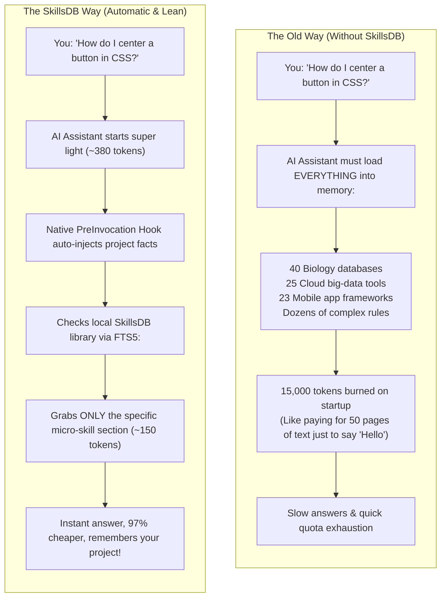
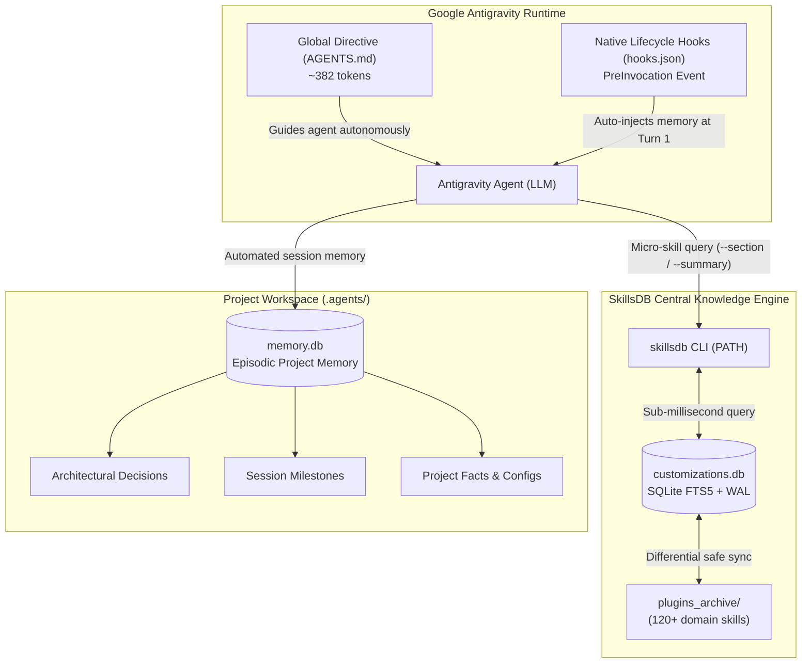

# SkillsDB: Centralized Customizations, Autonomous Memory & Token-Efficient Knowledge Engine for Google Antigravity

[](https://github.com/scorpion421/skillsdb/releases/tag/v2.1.0)
[](https://github.com/scorpion421/skillsdb)
[](https://www.python.org/)
[](https://github.com/PowerShell/PowerShell)
[](https://www.sqlite.org/)
[](https://deepmind.google/)
[](LICENSE)

**SkillsDB** is an enterprise-grade knowledge indexing, retrieval, and episodic memory architecture designed for Google Antigravity AI agents. It eliminates static prompt bloat by decoupling enterprise rules and 120+ domain skills into an embedded, on-demand SQLite FTS5 database with native lifecycle hook integration and zero cognitive load.

---

## What is SkillsDB and Why Do Beginners Need It?

If you are just getting started with coding or using AI assistants like Google Antigravity, all the technical discussions about *tokens*, *SQLite databases*, and *system prompts* might sound intimidating.

Here is the simple, real-world explanation:

### The Backpack Metaphor

Imagine hiring a smart assistant to help you learn programming or build your first project:
* **Without SkillsDB**: Every time you ask a simple question like *"How do I change this button color?"*, your assistant is forced to pack **120 heavy encyclopedias** into their backpack (covering mobile frameworks, data science libraries, cloud servers, and corporate rules) before answering you.
  * Result: Your assistant moves slowly, gets confused by irrelevant information, and quickly exhausts your daily AI usage limit.
* **With SkillsDB**: Your assistant carries only a lightweight notebook. When you ask about button styling, the assistant looks up *only* the single page on CSS from a local digital library in milliseconds, answers you immediately, and puts the book back.

---

### How It Works: Traditional Loading vs. SkillsDB



---

### 5 Big Benefits for Beginners & Pros

1. **You Won't Run Out of AI Usage Quota**:
   By reducing startup waste by **97.4%** and using micro-skills instead of full document dumps, you can code freely without hitting *"Usage limit reached"* warnings.
2. **Clearer, Higher-Quality Answers**:
   When the AI is not distracted by 100 tools it does not need for your task, its answers are more focused, concise, and easier to understand.
3. **Automatic Project Memory (Zero Repeated Explanations)**:
   SkillsDB automatically remembers your project's decisions, facts, and milestones in `.agents/memory.db`. Even in 1,800-step sessions, the agent never forgets past architectural agreements.
4. **Micro-Skills Engine (-85% Retrieval Overhead)**:
   Instead of loading a 2,500-token manual, the agent pulls only the specific 150-token recipe, checklist, or diagnostic snippet required.
5. **Zero User Friction**:
   You talk to your AI assistant naturally. SkillsDB works invisibly in the background with zero mandatory CLI commands.

---

## Technical Deep-Dive: The "Prompt Bloat" Crisis in AI Coding Assistants

By default, Google Antigravity discovers and injects every plugin found in `~/.gemini/config/plugins` into the agent's global system prompt on session startup. When developers install standard domain plugins (such as `science`, `flutter`, `data-agent-kit`, `firebase`, etc.), the cumulative token overhead triggers a critical warning:

```text
Customization token budget exceeded. Large customizations will be truncated.
```

### The Real Cost of Static Injection:
* **Over 15,000 tokens burned** on every single user prompt before work even begins.
* **Context Dilution**: The "Lost-in-the-Middle" phenomenon degrades model reasoning when overwhelmed by dozens of irrelevant tools.
* **Excessive Latency & Cost**: Unnecessary token transmission on every turn consumes API quotas and slows down response times.

---

## The Solution: On-Demand Decoupling (-97.4% Overhead)

SkillsDB replaces static prompt dumping with an indexed **SQLite knowledge engine** backed by SQLite FTS5 (Full-Text Search) and WAL (Write-Ahead Logging) mode. The agent starts with a lightweight directive (~380 tokens) and fetches domain skills and rules only when the user's task requires them.

| Metric | Traditional Static Loading | SkillsDB Architecture | Improvement |
| :--- | :--- | :--- | :--- |
| **Startup Prompt Overhead** | ~14,813 tokens | **~382 tokens** | **-97.4% reduction** |
| **Available Knowledge Base** | 120 skills (choking context) | **120 skills** (FTS5 indexed) | **100% capacity preserved** |
| **Skill Retrieval Cost** | 2,500 tokens (full file) | **~150 tokens** (Micro-Skills) | **-85% retrieval cost** |
| **Multi-Turn Step Efficiency** | 15k tokens per round-trip | **~380 tokens per round-trip** | **~37M+ tokens saved / 2,500 steps** |
| **Scalability Limit** | ~10-15 plugins maximum | **10,000+ skills effortlessly** | **Infinite scalability** |

---

## Architecture Overview



---

## Core Philosophy: Zero Cognitive Load ("Invisible Superpowers")

The core design principle of SkillsDB is **complete transparency**:

1. **Autonomous Knowledge Retrieval**:
   The user asks a question in plain natural language (*"Fix this layout overflow in Flutter"*). The agent detects the domain, queries `skillsdb suggest` in milliseconds, retrieves only the relevant micro-skill section, and executes the fix.
2. **Zero-Tool-Call Memory Ingestion**:
   Native `PreInvocation` hooks detect the project's `.agents/memory.db` and inject facts and recent milestones into the model's sightline as an ephemeral message on Turn 1 with zero tool overhead.
3. **Continuous Autonomous Learning**:
   Telling the agent *"Remember this convention"* automatically persists it to the database via `skillsdb mem-save-decision` (project) or `skillsdb learn-rule` (global) in the background.
4. **Continuous Flow (No Chat-Switch Nagging)**:
   The agent maintains precision across 1,000+ steps without interrupting the developer to restart chats.
5. **Safe Non-Destructive Updates**:
   Upgrades never overwrite user databases. Custom learned rules and project memories are 100% preserved.

---

## Project-Level Episodic Memory (`.agents/memory.db`)

To prevent bloating the global database with project-specific trivia while still preserving architectural decisions across sessions, each project maintains an isolated episodic SQLite memory:

* **Autonomous Lifecycle**:
  * **Trivial Queries** (*"How does this regex work?"*): Memory is bypassed entirely (0 token overhead, no disk footprint).
  * **Non-Trivial Tasks** (Refactoring, features, long sessions): The agent loads context at task start and records progress snapshots via `skillsdb mem-save-snapshot` upon completion.
* **Zero Orphan Footprint**: Deleting a project folder deletes its memory database instantly.
* **Auto-Pruning (`mem-prune`)**: Automatically reconciles deleted conversation IDs and reclaims disk space with incremental SQLite auto-vacuum.

---

## Safe Non-Destructive Updates (Zero Data Loss Guarantee)

SkillsDB includes an automated differential merge engine to keep workstations up to date without ever losing user customizations:

* **Automatic Pre-Update Backup**: Creates a timestamped safety backup (`customizations.db.bak_YYYYMMDD_HHMMSS`) before any modifications.
* **Differential SQLite Merge**: Using SQLite `ATTACH DATABASE`, official skills and rules are updated, while **100% of user-learned rules (`category = 'learned'`) and custom skills are preserved**.
* **Safety Audit & Rollback**: Validates that all user-learned rules remain intact after merge; automatically rolls back if any discrepancy is detected.
* **Untouched Project Memory**: Local `.agents/memory.db` files in workspace repositories are never touched during global updates.

---

## Quick Start & Installation

### Option 1: One-Command Deployment via Antigravity Agent
Simply clone the repository and tell your Antigravity agent:
> **"Please deploy Antigravity customizations from this repository"**

### Option 2: Automated Script Deployment

#### Windows (PowerShell):
```powershell
powershell -ExecutionPolicy Bypass -File .\deploy.ps1
```

#### Cross-Platform (Python):
```bash
python deploy.py
```

The script automatically:
1. Deploys `customizations.db` to `~/.gemini/database/`.
2. Installs the `skillsdb` CLI to `~/.gemini/antigravity/bin/` (in your system PATH).
3. Configures `customizations-db` with native lifecycle hooks in `~/.gemini/config/plugins/`.
4. Safely moves static legacy plugins to `~/.gemini/plugins_archive/` (eliminating prompt bloat).

---

## CLI Reference Guide

The global `skillsdb` command is accessible from any terminal and working directory:

### 1. Rules, Skills & Diagnostics
```powershell
# Display all active system rules
skillsdb get-active-rules

# Auto-suggest the best matching skills for a task
skillsdb suggest "Flutter widget layout overflow"

# Retrieve full instructions for a specific skill
skillsdb get-skill admin-elevation

# Micro-Skills: Inspect outline & section list (~80 tokens)
skillsdb get-skill flutter-fix-layout-issues --summary

# Micro-Skills: Load only a specific section (~150 tokens, saving 85% context)
skillsdb get-skill flutter-fix-layout-issues --section "Fixing RenderFlex Overflow"

# Autonomous Learning: Persist a learned rule globally into SQLite
skillsdb learn-rule "python-standards" "Python Guidelines" "Always use typing and dataclasses."

# Full-text search across all rules and 120 skills
skillsdb search "bigquery"

# Run system health diagnostics (DB integrity, PATH, hooks, git ignore)
skillsdb doctor

# View database statistics and measured token/cost savings
skillsdb stats

# Check for updates on GitHub (version comparison & changelog)
skillsdb check-update

# Safely update SkillsDB to latest release (zero data loss via differential merge)
skillsdb update
```

### 2. Project Memory (.agents/memory.db)
```powershell
# Retrieve recent project context (decisions + latest milestone, ~150 tokens)
skillsdb mem-get-context

# Save an architectural decision
skillsdb mem-save-decision "API HTTPS Port" "Use Port 5001 with JWT authentication"

# Save a session milestone snapshot
skillsdb mem-save-snapshot "Migrated authentication middleware" --next-steps "Write integration tests"

# Save a key-value configuration fact
skillsdb mem-save-fact "DB_HOST" "sql01.internal.local"

# Full-text search within project memory
skillsdb mem-search "JWT"

# Prune deleted conversations and vacuum database
skillsdb mem-prune
```

### 3. Database Management & Team Synchronization
```powershell
# Re-index all skills from global and archived plugins
skillsdb import-all

# Import any Markdown rule or skill file
skillsdb import-file "path/to/custom_skill.md"

# Push local database updates to network team share
skillsdb sync push

# Pull latest team database updates from network share
skillsdb sync pull
```

---

## Global System Rules Enforced

All Antigravity agents running with SkillsDB adhere to 6 core directives:

1. **Universal Formatting Invariants**: Strictly no em-dashes (Unicode U+2014) or en-dashes (Unicode U+2013); strictly no emojis.
2. **Communication**: Informal German ("Du", never "Sie") with natural German spelling including umlauts (ä, ö, ü, ß).
3. **Scripting Standards**: Professional English code, comments, and outputs (ASCII only); proper error handling; strictly no VBScript.
4. **Admin Elevation**: Seamless execution with elevated administrator privileges using encrypted Windows DPAPI credentials without interactive UAC prompts.
5. **Token Efficiency**: Strict context hygiene (line-sliced file views, bounded command outputs, subagent isolation for wide searches, concise responses).
6. **Autonomous Project Memory & Continuous Flow**: Persistent episodic memory across sessions; autonomous micro-skill routing and snapshotting; zero chat-switching interruptions.

---

## Project Structure

```text
SkillsDB/
├── .agents/                    # Project-level episodic memory (.agents/memory.db)
├── database/
│   ├── customizations.db       # Central SQLite database (120 skills, 8 rules, FTS5)
│   └── db_manager.py           # Core CLI engine, micro-skills, and safe update manager
├── plugin/
│   ├── plugin.json             # Antigravity plugin manifest
│   ├── hooks.json              # Native PreInvocation lifecycle hook
│   ├── rules/
│   │   └── AGENTS.md           # Minimal ~380-token system prompt directive
│   └── skills/
│       └── customizations-db/  # Customization DB interface skill
├── tests/
│   └── test_autonomous.py      # Automated unit test suite (differential merge, hooks, etc.)
├── deploy.ps1                  # PowerShell automated deployment script (Windows)
├── deploy.py                   # Python automated deployment script (Cross-platform)
├── .gitignore                  # Git hygiene configuration
└── README.md                   # System documentation
```

---

## License

This project is licensed under the [MIT License](LICENSE).
