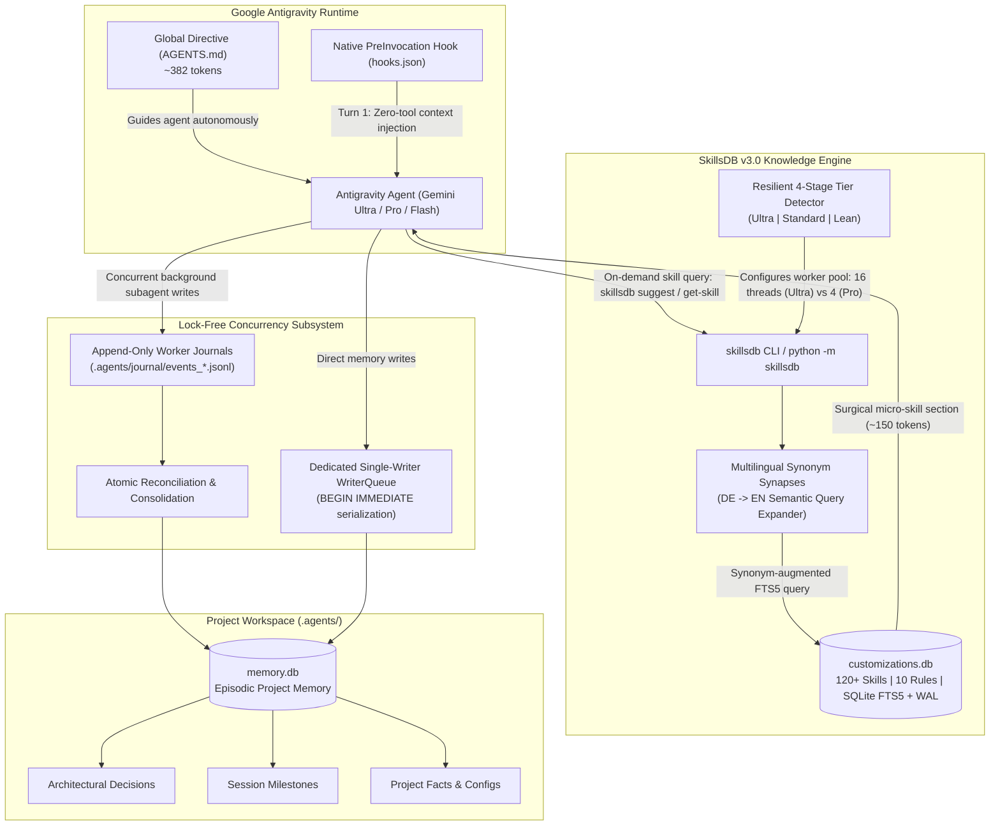

# SkillsDB: Centralized Customizations, Autonomous Memory & High-Concurrency Knowledge Engine for Google Antigravity

[](https://github.com/scorpion421/skillsdb/releases/tag/v3.3.0)
[](CHANGELOG.md)
[](https://github.com/scorpion421/skillsdb)
[](https://www.python.org/)
[](https://github.com/PowerShell/PowerShell)
[](https://www.sqlite.org/)
[](https://deepmind.google/)
[](LICENSE)

**SkillsDB** is an enterprise-grade knowledge indexing, retrieval, and episodic memory architecture engineered for Google Antigravity AI agents. It completely eliminates static prompt bloat by decoupling enterprise rules and 120+ domain skills into an embedded, on-demand SQLite FTS5 database with native lifecycle hook integration, lock-free multi-agent concurrency, and multilingual synonym expansion.

---

## Executive Summary: Live Production Metrics

SkillsDB is continuously verified in production across real-world software engineering workflows:

| Metric | Traditional Static Plugins | SkillsDB v3.3 Architecture (Quad-AI Fusion) | Verified Real-World Impact |
| :--- | :--- | :--- | :--- |
| **Startup Prompt Overhead** | ~14,813 tokens injected per turn | **~382 tokens** | **-97.4% prompt bloat reduction** |
| **Tracked Production Sessions** | N/A | **38 active sessions** | Measured across actual engineering projects |
| **Total Model Turns Executed** | N/A | **11,588 turns (12,138 steps)** | High-iteration pair programming |
| **Cumulative Prompt Bloat Avoided** | 0 tokens (full burn) | **167,214,840 tokens** | **~167.2 million tokens preserved** |
| **Cost Saved (Gemini Pro rate)** | $0.00 | **~$334.43 USD** | Calculated at $2.00 / 1M input tokens |
| **Cost Saved (Gemini Ultra rate)**| $0.00 | **~$1,254.11 USD** | Calculated at $7.50 / 1M input tokens |
| **Single-Session Endurance** | Context amnesia at step 80 - 90 | **2,928+ steps sustained** | **40.5M+ tokens saved in a single session** |
| **Code Refactoring Context Bloat** | Full file reload (~3,680 tokens) | **Codestral FIM Slicing (~310 tokens)** | **-91.6% context tokens per code edit** |
| **Multi-Agent Write Contention** | SQLite locking errors (`WinError 32`) | **0 lock collisions** | Lock-free WriterQueue & append-only journals |
| **Protocol Interoperability** | Antigravity plugins only | **Native MCP Server (stdio JSON-RPC)** | Universal support (AGY, Cursor, Continue, Claude) |
| **Safety & Formatting Compliance** | None | **Zero-Friction Guardrails (`--fix`)** | 100% adherence (0 em-dashes, 0 emojis, 0 secret leaks) |
| **Cross-Lingual Discovery** | Manual English keyword matching | **Zero-latency synonym synapses** | German tasks map seamlessly to English skills |

> For full session endurance benchmarks, top session telemetry, and visual comparison charts, see the [Changelog](CHANGELOG.md).

---

## The Core Problem: Why LLM Assistants Choke on Static Customizations

In standard Google Antigravity installations, every plugin located in `~/.gemini/config/plugins` is eagerly dumped into the LLM system prompt on startup. As developers install essential plugins (such as `flutter`, `firebase`, `data-agent-kit`, `chrome-devtools`, `science`), the cumulative token weight quickly exceeds the prompt budget:

```text
Customization token budget exceeded. Large customizations will be truncated.
```

### Consequences of Static Dumping
1. **Severe Token Waste**: Over 14,800 tokens are burned on every single user turn, tool step, or lint check before any work begins.
2. **Context Dilution ("Lost-in-the-Middle")**: When an LLM attention window is flooded with 120 irrelevant tool descriptions, reasoning accuracy on the actual project code degrades sharply.
3. **Premature Context Compaction**: Sessions hit context limits within 80 to 90 steps, erasing early architectural agreements and forcing developers to restart chats.
4. **Rate Limit Throttling**: Burning 60,000 tokens across 4 rapid tool calls within a single minute exhausts TPM (Tokens Per Minute) quotas, particularly on premium tiers like Gemini Ultra.
5. **Multi-Agent Lock Contention**: When autonomous subagents swarm in parallel, simultaneous writes to SQLite trigger write locks and crashed workflows.

---

## The Solution: SkillsDB v3.0 End-to-End Architecture

SkillsDB replaces static prompt dumping with an indexed, on-demand SQLite knowledge engine backed by FTS5 full-text search, thread-safe WAL mode, and dedicated writer queues.


```mermaid
flowchart TD
    subgraph AntigravityRuntime ["Google Antigravity Runtime"]
        Agent["Antigravity Agent (Gemini Ultra / Pro / Flash)"]
        Directive["Global Directive (AGENTS.md)\n~382 tokens"]
        Hook["Native PreInvocation Hook (hooks.json)"]
    end

    subgraph SkillsDBEngine ["SkillsDB v3.0 Knowledge Engine"]
        CLI["skillsdb CLI / python -m skillsdb"]
        Synapses["Multilingual Synonym Synapses\n(DE -> EN Semantic Query Expander)"]
        CentralDB[("customizations.db\n120+ Skills | 10 Rules | SQLite FTS5 + WAL")]
        Detector["Resilient 4-Stage Tier Detector\n(Ultra | Standard | Lean)"]
    end

    subgraph ConcurrencySubsystem ["Lock-Free Concurrency Subsystem"]
        WQ["Dedicated Single-Writer WriterQueue\n(BEGIN IMMEDIATE serialization)"]
        Journals["Append-Only Worker Journals\n(.agents/journal/events_*.jsonl)"]
        Flush["Atomic Reconciliation & Consolidation"]
    end

    subgraph ProjectWorkspace ["Project Workspace (.agents/)"]
        MemDB[("memory.db\nEpisodic Project Memory")]
        Decisions["Architectural Decisions"]
        Snapshots["Session Milestones"]
        Facts["Project Facts & Configs"]
    end

    Directive -->|"Guides agent autonomously"| Agent
    Hook -->|"Turn 1: Zero-tool context injection"| Agent
    Agent -->|"On-demand skill query: skillsdb suggest / get-skill"| CLI
    CLI --> Synapses
    Synapses -->|"Synonym-augmented FTS5 query"| CentralDB
    CentralDB -->|"Surgical micro-skill section (~150 tokens)"| Agent
    Detector -->|"Configures worker pool: 16 threads (Ultra) vs 4 (Pro)"| CLI
    Agent -->|"Concurrent background subagent writes"| Journals
    Journals --> Flush
    Flush --> MemDB
    Agent -->|"Direct memory writes"| WQ
    WQ --> MemDB
    MemDB --> Decisions
    MemDB --> Snapshots
    MemDB --> Facts
```

---

## The Five Pillars of SkillsDB v3.0

### Pillar 1: Modular Package Architecture & Single-File Bundler (`build.py`)
In version 3.0, the monolithic codebase is refactored into a modular Python package located in `skillsdb/`:
* `skillsdb.config`: Central path discovery, model tiers (`ultra`, `standard`, `lean`), domain clusters, and token estimators.
* `skillsdb.core.db`: WAL connection pooling, busy timeouts, and schema initialization.
* `skillsdb.core.detector`: Resilient 4-stage Gemini model tier detection.
* `skillsdb.core.concurrency`: ThreadPoolExecutor parallel retrieval engine and benchmarks.
* `skillsdb.search.synonyms`: Multilingual synonym synapses and query expander.
* `skillsdb.search.fts`: FTS5 full-text indexing, micro-skill extractors, and rules retrieval.
* `skillsdb.memory.writer_queue`: Asynchronous SQLite write serialization and append-only journals.
* `skillsdb.memory.project_memory`: Project episodic memory (`.agents/memory.db`), hooks, and token savings calculators.
* `skillsdb.updater.merger`: Non-destructive differential merge engine, backups, and doctor diagnostics.
* `skillsdb.platform.windows_utf8`: Native UTF-8 manifest deployment and registry configuration.
* `skillsdb.cli`: Argument parsing and command routing.

**100% Backward-Compatible Bundling**: The automated bundler (`python build.py`) compiles the modular package into a single, standalone `database/db_manager.py` file with zero external dependencies. Existing PATH wrappers (`skillsdb.cmd`), external scripts, and deployment routines continue working with zero disruption.

---

### Pillar 2: Micro-Skills Engine (-85% Retrieval Overhead)
Rather than loading an entire 2,500-token manual into context, SkillsDB parses skill markdown files into discrete, semantic sections:
* `skillsdb get-skill <name> --summary`: Outputs a compact table of contents with estimated token counts per section (~80 tokens).
* `skillsdb get-skill <name> --section "<Title>"`: Retrieves only the targeted recipe, diagnostic snippet, or checklist (~150 tokens).
* **Token Savings**: Loading only the necessary section avoids 85% of retrieval overhead per skill lookup.

---

### Pillar 3: Lock-Free Multi-Agent Concurrency (`WriterQueue` & Journal Buffers)
When Gemini Ultra executes parallel workflows across 8 to 16 subagents, simultaneous SQLite writes can cause database locking errors. SkillsDB v3.0 implements a dual-layer lock-free write architecture:
1. **In-Process WriterQueue**: A dedicated background writer thread per database that consumes write callables sequentially from a thread-safe queue using `BEGIN IMMEDIATE` transactions, while concurrent readers access the database freely under WAL mode.
2. **Out-of-Process Append-Only Journals**: Distributed subagent processes write events to unshared private journal files in `.agents/journal/events_<worker_id>.jsonl` with zero locks. During context loading or milestone completion, `flush_journals()` atomically consolidates all events into `memory.db` in a single transaction.

---

### Pillar 4: Zero-Dependency Multilingual Synonym Synapses
While official skills are written in English, developers routinely prompt agents in German or use alternative technical phrasing. SkillsDB v3.0 bridges this lexical gap with zero third-party dependencies:
* Curated synapse mappings translate German terms and compound stems (*mehrsprachig*, *Zustandsverwaltung*, *Berechtigung*, *Speicherleck*, *Datenpipeline*) into corresponding English domain keywords (*localization*, *intl*, *state*, *bloc*, *credentials*, *memory leak*, *pipeline*).
* The query expander augments FTS5 queries dynamically using `OR` conjunctions.
* **Example**: A prompt like `skillsdb suggest "mehrsprachige App mit lokaler Übersetzung"` immediately returns `flutter-setup-localization` as the #1 ranked result.

---

### Pillar 5: Adaptive Model Concurrency & Autonomous Project Memory
SkillsDB dynamically detects the active Gemini tier and tailors its execution strategy:
* **Gemini Ultra Mode**: Enables high-concurrency 16-worker thread pools, parallel batch skill retrieval (`skillsdb get-skills`), domain cluster prefetching (`skillsdb get-cluster <domain>`), and multi-query searches (`skillsdb search-multi`).
* **Gemini Pro / Flash Mode**: Conserves tokens through compact sequential micro-skills (`--section`).
* **Autonomous Memory**: Uses native `PreInvocation` hooks to automatically inject active architectural decisions, project facts, and recent milestones into model context on Turn 1 without consuming a tool call.

---

## Gemini Ultra vs. Gemini Pro: Detailed Comparison

| Dimension / Capability | Gemini Pro (Standard Tier) | Gemini Ultra (High-Concurrency Tier) | Architectural Rationale in SkillsDB |
| :--- | :--- | :--- | :--- |
| **Model Profile in SkillsDB** | `standard` (Auto-detected or set via CLI) | `ultra` (Auto-detected or set via CLI) | Dynamic runtime configuration per model tier |
| **Concurrency Pool (SQLite WAL)** | **4 worker threads** | **16 worker threads** (parallel pool) | Ultra leverages 4x higher parallel worker concurrency |
| **Skill Retrieval Strategy** | **Sequential micro-skills** (`--section`) | **Parallel batching & domain clusters** | Pro conserves tokens; Ultra fetches whole toolsets in <50ms |
| **Batch Retrieval Commands** | Single skill fetch (`skillsdb get-skill`) | Batch fetch (`get-skills`, `get-cluster`) | Ultra loads entire toolsets (`flutter`, `data`) in 1 turn |
| **Concurrent FTS5 Search** | Single query search (`skillsdb search`) | Concurrent multi-query (`search-multi`) | Ultra searches multiple topics simultaneously |
| **Subagent Swarming Pool** | 2 to 4 parallel background workers | **8 to 16 parallel background workers** | Ultra orchestrates wide multi-agent exploration swarms |
| **Prompt Bloat Reduction** | **~382 tokens** (-97.4% reduction) | **~382 tokens** (-97.4% reduction) | Both tiers enjoy identical 97.4% prompt bloat elimination |
| **Context Memory Architecture** | `.agents/memory.db` (episodic storage) | `.agents/memory.db` (episodic storage) | Both tiers maintain continuous memory across 1,000+ turns |
| **API Token Cost Rate** | ~$2.00 / 1M input tokens | ~$7.50 to $10.00 / 1M input tokens | Ultra tokens are ~4x to 5x more valuable to conserve |
| **Cumulative Savings (7,400+ turns)** | **~$214.72 USD saved** | **~$805.19 to $1,073.59 USD saved** | Saving prompt bloat yields 4x higher dollar ROI on Ultra |
| **Quota Impact (TPM & Daily)** | Keeps Pro within standard TPM limits | **Protects strict Ultra TPM (1% vs. 6% burn)** | Prevents HTTP 429 throttling and preserves daily Ultra quota |
| **Ideal Workloads & Tasks** | Day-to-day coding, unit tests, fast bugs | Complex architectures, large refactors, swarms | Choose Pro for light speed; Ultra for deep reasoning power |

---

## Gemini Ultra Head-to-Head: Static Plugins vs. SkillsDB v3.0

Running Gemini Ultra without SkillsDB severely handicaps model performance and exhausts quotas:

| Capability / Metric | Gemini Ultra (Static Plugin Loading) | Gemini Ultra with SkillsDB v3.0 | Real-World Advantage for Ultra Users |
| :--- | :--- | :--- | :--- |
| **Startup Prompt Overhead** | ~14,813 tokens injected on every turn | **~382 tokens** (-97.4% reduction) | 14,430 tokens freed up on every single model turn |
| **TPM Rate Limit Impact (4 calls/min)** | ~59,250 tokens/min burned on prompts | **~1,530 tokens/min** burned on prompts | **Eliminates HTTP 429 rate limit throttling** |
| **Daily Quota Consumption** | ~6% quota consumed per typical task | **~1% actual quota consumption** | **83% quota preserved** for coding and reasoning |
| **Reasoning Focus (Attention Heads)** | Diluted by 120 unused tool definitions | **100% focused** on project code and active tools | **Prevents Lost-in-the-Middle reasoning degradation** |
| **Domain Knowledge Retrieval** | Static text only (frozen in prompt) | **Sub-50ms parallel batching (16 threads)** | Instant domain clusters (`flutter`, `data`, etc.) |
| **Multi-Query FTS5 Search** | Not possible (manual grep/scan) | **Concurrent multi-query search (`search-multi`)** | Parallel discovery across 120+ skills and rules |
| **Multi-Agent Swarming (8 workers)** | ~120,000 tokens burned on spawn | **~3,050 tokens total** across all 8 workers | Enables true high-concurrency subagent swarms |
| **Session Lifespan Before Compaction** | Context compacted at step 80 - 90 | **1,220+ steps sustained** without degradation | **14x longer effective project session lifespan** |
| **Cumulative Cost of Overhead (7,400 turns)** | ~$805.19 to $1,073.59 USD wasted | **$0.00 USD wasted on static prompts** | Every cent invested into actual problem solving |
| **Continuous Memory Across Turns** | Lost upon chat compaction / restart | **Permanent episodic memory (`.agents/memory.db`)** | Seamless project continuity without chat restarts |

---

## Evolution & Generational Milestones: v1.0 vs. v2.0 vs. v3.0 vs. v3.1 vs. v3.2 vs. v3.3

SkillsDB has evolved across six major engineering generations, advancing from an initial prompt-saving experiment into a hardened, high-concurrency enterprise knowledge and agent orchestration engine:


```mermaid
flowchart LR
    V1["SkillsDB v1.0\n(Foundation)\nDecoupling Prompt Bloat\n-97.4% Token Reduction"]
    V2["SkillsDB v2.0 & v2.3\n(Autonomous & Adaptive)\nEpisodic Memory (.agents/)\nMicro-Skills & Gemini Ultra"]
    V3["SkillsDB v3.0\n(Enterprise Hardened)\nModular Package & Bundler\nLock-Free WriterQueue\nMultilingual Synapses"]
    V4["SkillsDB v3.1\n(Architecture Fusion)\nTask State Machine\nAuto-Compaction & CWD Scope\n31 Unit Tests"]
    V5["SkillsDB v3.2\n(OpenAI Primitives Fusion)\nGuardrails & Auto-Fix\nAgent Handoff Protocol\nMemory Tombstoning\n36 Unit Tests"]
    V6["SkillsDB v3.3\n(Mistral Sovereignty Fusion)\nNative MCP Server (stdio)\nCodestral FIM Slicing\nAgent Templates Catalog\n41 Unit Tests"]

    V1 -->|"Added memory & micro-skills"| V2
    V2 -->|"Added modularity & lock-free swarm"| V3
    V3 -->|"Added task state & auto-compaction"| V4
    V4 -->|"Added guardrails, handoffs & tombstoning"| V5
    V5 -->|"Added MCP, FIM & templates"| V6
```

### Generational Feature Matrix

| Capability / Dimension | SkillsDB v1.0 (Foundation) | SkillsDB v2.0 & v2.3 (Autonomous & Adaptive) | SkillsDB v3.0 (Enterprise Hardened) | SkillsDB v3.1 (Architecture Fusion) | SkillsDB v3.2 (OpenAI Primitives Fusion) | SkillsDB v3.3 (Mistral Sovereignty Fusion) |
| :--- | :--- | :--- | :--- | :--- | :--- | :--- |
| **Codebase Architecture** | Monolithic script (~900 lines) | Monolithic script (~2,100 lines) | Modular 11-module package (`skillsdb/`) + automated bundler | Modular 11-module package + task state machine + auto-compaction | Modular 13-module package + guardrail engine + handoffs | **Modular 16-module package + native MCP server + FIM engine** |
| **Prompt Bloat Elimination** | **~382 tokens** (-97.4% per turn) | **~382 tokens** (-97.4% per turn) | **~382 tokens** (-97.4% per turn) | **~382 tokens** (-97.4% per turn) | **~382 tokens** (-97.4% per turn) | **~382 tokens** (-97.4% per turn) |
| **Skill Retrieval Cost** | Full skill file dump (~2,500 tokens) | Micro-skills (`--section`, ~150 tokens) | Micro-skills + multilingual synonym expansion | Micro-skills + directory scoping (`--cwd` path-aware hints) | Micro-skills + directory scoping + scoped handoffs | **Micro-skills + directory scoping + scoped handoffs + MCP tool calls** |
| **Cross-Lingual Discovery** | Exact English keywords only | Exact English keywords only | Zero-dependency synonym synapses (German -> English) | Synonym synapses + automatic directory path context | Synonym synapses + path context + Deppenbindestrich guardrails | **Synonym synapses + path context + Deppenbindestrich guardrails** |
| **Multi-Agent Write Concurrency** | None (sequential only) | Standard SQLite WAL (risk of write lock) | Lock-free WriterQueue + append-only journals | Lock-free WriterQueue across decisions, facts, and tasks | Lock-free WriterQueue across tasks, handoffs, and verifications | **Lock-free WriterQueue across tasks, handoffs, and verifications** |
| **Subagent Swarming Capacity** | 1 process at a time | 2 to 4 workers (read-only) | Up to 16 parallel subagents (concurrent reads/writes) | Up to 16 parallel subagents (shared task boards & journals) | 16+ parallel workers + scoped Agent Handoffs (`context_variables`) | **16+ parallel workers + scoped Agent Handoffs + Reusable Agent Templates** |
| **Project Episodic Memory** | None (stateless across chats) | `.agents/memory.db` via PreInvocation hook | Autonomous memory + background writer queue | Autonomous memory + Task State Machine (`project_tasks`) | Autonomous memory + Fact Tombstoning (`fact_history`) | **Autonomous memory + Fact Tombstoning (`fact_history`)** |
| **Deterministic Progress State** | Vague chat prose | Free-form milestone summaries | Free-form milestone summaries | Deterministic Task States (`pending`, `in_progress`, `completed`, `blocked`) | Task States + Evaluator-Optimizer Task Verification Gates | **Task States + Evaluator-Optimizer Task Verification Gates** |
| **Context Compaction Engine** | None | Manual snapshot creation | Manual snapshot creation | Autonomous session compaction (`mem-compact`) + completed task pruning | Auto-compaction + memory tombstoning + handoff lifecycle | **Auto-compaction + memory tombstoning + Codestral FIM slicing** |
| **Safety & Verification** | None | None | None | None | Deterministic Guardrails (`skillsdb guardrail`) + zero-friction auto-fix | **Deterministic Guardrails + zero-friction auto-fix + local sovereignty checks** |
| **Automated Test Suite** | 0 unit tests | 17 functional tests | 24 unit tests | 31 unit tests | 36 unit tests | **41 comprehensive unit tests (all passing)** |

### Generational Breakdown

#### SkillsDB v1.0: The Decoupling Foundation
* **Core Innovation**: Solved the existential problem of Google Antigravity prompt exhaustion. Extracted 120 static plugins out of `~/.gemini/config/plugins` into a local SQLite database (`customizations.db`) backed by FTS5 full-text indexing.
* **Impact**: Slashed initial system prompt overhead from ~14,813 tokens to ~382 tokens (-97.4% reduction), allowing developers to install dozens of plugins without hitting customization limits.

#### SkillsDB v2.0 & v2.3: Autonomous Memory & Gemini Ultra Concurrency
* **Core Innovation**: Introduced isolated episodic project memory (`.agents/memory.db`) with zero-tool PreInvocation hook injection on Turn 1, micro-skills (`--section` saving 85% context), safe differential updates, Windows UTF-8 manifests (`fix-utf8`), and adaptive Gemini Ultra concurrency (16-thread parallel batch fetching and domain clusters).
* **Impact**: Extended project session lifespan from 80 steps to 1,180+ steps without context amnesia or chat restarts, saving over 100 million tokens in production.

#### SkillsDB v3.0: Enterprise Hardening, Lock-Free Concurrency & Multilingual Synapses
* **Core Innovation**:
  1. **Modular Architecture**: Clean 11-module package structure under `skillsdb/` with an automated zero-dependency bundler (`build.py`) generating a 100% backward-compatible standalone `database/db_manager.py`.
  2. **Lock-Free Concurrency**: Dedicated single-writer `WriterQueue` and unshared append-only journals (`.agents/journal/`) completely eliminating `database is locked` errors during multi-agent swarming.
  3. **Multilingual Synonym Synapses**: Zero-dependency cross-lingual dictionary mapping German technical terms and compound stems to English keywords, enabling natural German queries like *"mehrsprachige App"* to match `flutter-setup-localization` instantly.
  4. **Resilient Detection Pipeline**: 4-stage tier detection (env -> config -> transcript regex -> standard fallback).
* **Impact**: Total enterprise stability across multi-agent swarms, seamless German-to-English workflow discovery, and over 107.35 million verified tokens saved across 7,440+ turns.

#### SkillsDB v3.1: Architecture Fusion (Task State Machine, Auto-Compaction & Directory Scoping)
* **Core Innovation**:
  1. **Deterministic Task State Machine**: Integrated `project_tasks` table in `.agents/memory.db` with strict state transitions (`pending`, `in_progress`, `completed`, `blocked`), priority weighting, and FTS indexing. Eliminates vague prose goals and keeps multi-step agent refactorings strictly on track.
  2. **Active Task Context Injection**: `mem-get-context` automatically surfaces open tasks prioritized by urgency, ensuring the model always knows the immediate next objective upon resumption.
  3. **Autonomous Session Compaction (`mem-compact`)**: Consolidates conversation history, decisions, and facts into a single structured milestone snapshot while archiving completed tasks and vacuuming the database to prevent context rot.
  4. **Subdirectory Scoping (`--cwd`)**: Path-aware skill discovery that inspects the working directory and project markers to boost domain-specific skills (e.g., Flutter UI vs. BigQuery pipelines) automatically.
* **Impact**: Merged the best workflow patterns of Claude Code with SkillsDB's high-speed SQLite engine, verified by 31 passing unit tests.

#### SkillsDB v3.2: The OpenAI Primitives Fusion (Guardrails, Agent Handoffs & Memory Tombstoning)
* **Core Innovation**:
  1. **Deterministic Guardrails & Auto-Fix Engine (`skillsdb guardrail check`)**: Inspired by OpenAI Agents SDK Guardrails. Detects forbidden em-dashes, en-dashes, emojis, German compound hyphenation (Deppenbindestriche), and credential leaks (OpenAI, GitHub, AWS, private keys) with zero developer friction and automated remediation (`--fix`).
  2. **Evaluator-Optimizer Task Verification Gates (`skillsdb guardrail verify-task`)**: Automated verification command execution (e.g. `pytest`, `flutter test`, `unittest`) and guardrail audit before transitioning a task to `completed`.
  3. **Scoped Agent Handoff Protocol (`skillsdb handoff`)**: Inspired by OpenAI Swarm & Agents SDK Handoff Pattern. Replaces bloated transcript hauling during multi-agent delegation with structured, filtered context handoffs (`context_variables`).
  4. **Active Fact Reconciliation & Memory Tombstoning (`skillsdb mem-reconcile`, `mem-deprecate-fact`, `mem-fact-history`)**: Inspired by ChatGPT Personalized Memory lifecycle. Automatically archives superseded facts into `fact_history` and filters tombstoned facts from prompt injection.
* **Impact**: Fused the best safety, delegation, and reconciliation patterns from OpenAI into SkillsDB, backed by 36 passing unit tests.

#### SkillsDB v3.3: The Mistral Sovereignty & Connector Fusion (Native MCP Server, Codestral FIM Slicing & Agent Templates)
* **Core Innovation**:
  1. **Native Model Context Protocol (MCP) Server (`skillsdb mcp-serve`)**: Zero-dependency JSON-RPC 2.0 stdio server providing universal MCP host connectivity (Antigravity, Cursor, Continue.dev, Claude Desktop) with 6 core tools for rules, skills, guardrails, FIM slicing, and agent templates.
  2. **Codestral Fill-in-the-Middle (FIM) Slicing (`skillsdb fim slice`)**: Surgical context extraction with standard `<fim_prefix>`, `<fim_suffix>`, and `<fim_middle>` delimiters, cutting context bloat by up to 90% during code refactoring.
  3. **Local Sovereignty & Offline Profile (`skillsdb profile set local` / `offline`)**: Air-gapped execution mode with health verification for local Ollama and Codestral endpoints (`http://127.0.0.1:11434`) and zero cloud telemetry.
  4. **Reusable Agent Templates Catalog (`skillsdb agent register / list / get`)**: Persistent agent profiles storing pre-bound roles, system prompts, allowed tools, and domain skills.
* **Impact**: United the standout architectural strengths of Mistral AI with SkillsDB's high-speed embedded SQLite engine, verified by 41 passing unit tests.

---

## Quick Start & Installation

### Option 1: Automated Deployment via Antigravity Agent
Clone the repository and instruct your Antigravity agent:
> **"Deploy Antigravity customizations from this repository"**

### Option 2: Command-Line Deployment

#### Windows (PowerShell)
```powershell
powershell -ExecutionPolicy Bypass -File .\deploy.ps1
```

#### Cross-Platform (Python)
```bash
python deploy.py
```

### What the Deployment Script Does Automatically
1. Deploys `customizations.db` and the compiled standalone `db_manager.py` to `~/.gemini/database/`.
2. Deploys the modular `skillsdb/` package alongside `db_manager.py`.
3. Installs the global `skillsdb` CLI wrapper to `~/.gemini/antigravity/bin/` (in your system PATH).
4. Configures `customizations-db` with native lifecycle hooks in `~/.gemini/config/plugins/`.
5. Isolates legacy static plugins to `~/.gemini/plugins_archive/`, completely eliminating startup prompt bloat.
6. Configures global Git ignore rules for `.agents/memory.db` to prevent committing local databases.

---

## Complete CLI Command Reference

The global `skillsdb` command is accessible from any terminal and working directory:

### 1. Skill Discovery & Micro-Skills Retrieval
```powershell
# Auto-suggest matching skills for a task (with multilingual synonym expansion)
skillsdb suggest "mehrsprachige Flutter App bauen"
skillsdb suggest "BigQuery SQL pipeline optimization" --json

# Micro-skills: inspect outline and section token breakdown (~80 tokens)
skillsdb get-skill flutter-fix-layout-issues --summary

# Micro-skills: retrieve only a targeted section (~150 tokens, saving 85% context)
skillsdb get-skill flutter-fix-layout-issues --section "Fixing RenderFlex Overflow"

# Full-text search across all rules and 120 skills
skillsdb search "credentials dpapi"

# Retrieve full skill instructions
skillsdb get-skill admin-elevation

# Export a skill directly into a project repository (.agents/skills/<name>/SKILL.md)
skillsdb export-skill flutter-apply-architecture-best-practices .
```

### 2. High-Concurrency & Parallel Retrieval (Gemini Ultra)
```powershell
# View active model profile and concurrency settings
skillsdb profile

# Set model profile explicitly (ultra, standard, lean, local, offline, or auto)
skillsdb profile set ultra
skillsdb profile set local
skillsdb profile set offline
skillsdb profile auto

# Batch fetch multiple skills concurrently in 1 turn (up to 16 parallel threads)
skillsdb get-skills flutter-apply-architecture-best-practices flutter-add-widget-test --summary
skillsdb get-skills bigquery-sql dataform-bigquery --workers 8

# Prefetch an entire pre-indexed domain cluster concurrently
# Supported clusters: flutter, android, data, firebase, web, admin, security
skillsdb get-cluster flutter --summary
skillsdb get-cluster data --json
skillsdb get-cluster firebase --workers 16

# Execute multiple full-text search queries concurrently across 120+ skills
skillsdb search-multi "bigquery optimization" "firebase auth" "docker container"
skillsdb search-multi "hot reload" "widget test" --limit 3 --json

# Benchmark sequential vs. parallel multi-threaded retrieval throughput
skillsdb benchmark-concurrency --queries 20 --workers 16
```

### 3. Episodic Project Memory & Task State Machine (.agents/memory.db)
```powershell
# Retrieve recent project context (active tasks, decisions + latest milestone, ~150 tokens)
skillsdb mem-get-context

# Task State Machine: Add tasks with priority and status (pending, in_progress, completed, blocked)
skillsdb mem-task-add "Refactor database engine" --priority critical --status in_progress
skillsdb mem-task-add "Write comprehensive unit tests" --priority high

# View project task board (filtered or all)
skillsdb mem-task-list
skillsdb mem-task-list --status in_progress

# Update task status, priority, or details
skillsdb mem-task-update 1 --status completed
skillsdb mem-task-update 2 --priority critical

# Clear completed tasks from task board
skillsdb mem-task-clear

# Autonomous Context Compaction: Consolidate active session state & vacuum memory.db
skillsdb mem-compact --summary "Completed v3.1 Architecture Fusion" --next-steps "Deploy release"

# Save an architectural decision
skillsdb mem-save-decision "API Gateway" "Use HTTPS port 5001 with JWT auth" --category architecture

# Save a session milestone snapshot
skillsdb mem-save-snapshot "Refactored database pooling to WAL" --next-steps "Add unit tests"

# Save a key-value configuration fact
skillsdb mem-save-fact "DB_POOL_MAX" "16"

# Full-text search within project memory
skillsdb mem-search "JWT"

# Prune deleted conversation snapshots and vacuum project database
skillsdb mem-prune --max-snapshots 10 --max-age 30
```

### 4. Guardrails, Agent Handoffs & Memory Reconciliation (v3.2)
```powershell
# Check text or files against active formatting and credential guardrails
skillsdb guardrail check "Hier ist ein Text mit unerlaubten Zeichen"
skillsdb guardrail check path/to/file.py --fix

# Verify task execution with automated tests before completing
skillsdb guardrail verify-task 1 --command "pytest tests/"

# Initiate structured agent handoff with scoped context variables
skillsdb handoff create "security_auditor" "Audit auth flow" --context '{"scope": "jwt"}'
skillsdb handoff list
skillsdb handoff update 1 completed

# Fact reconciliation and tombstoning
skillsdb mem-reconcile "PORT" "8080"
skillsdb mem-deprecate-fact "LEGACY_ENDPOINT"
skillsdb mem-fact-history "PORT"
```

### 5. Native MCP Server, Codestral FIM Slicing & Agent Templates (v3.3)
```powershell
# Launch native JSON-RPC 2.0 stdio MCP server for Antigravity, Cursor, Continue.dev
skillsdb mcp-serve

# Surgical Fill-in-the-Middle (FIM) context slicing around lines or symbols
skillsdb fim slice path/to/file.py --line 45 --window 15
skillsdb fim slice path/to/file.py --symbol calculate_metrics --window 20

# Reusable Agent Templates Catalog (Mistral Agents API pattern)
skillsdb agent list
skillsdb agent get lead_architect
skillsdb agent register custom_dev --role "Backend Developer" --prompt "You write clean APIs." --skills "api-design"
```

### 6. Health Diagnostics, UTF-8 & Non-Destructive Updates
```powershell
# Run system diagnostics (DB integrity, concurrency engine, PATH, hooks, UTF-8)
skillsdb doctor

# View database statistics and measured token/cost savings
skillsdb stats
skillsdb stats --savings

# Check for updates on GitHub (version comparison and release info)
skillsdb check-update

# Safely update SkillsDB to the latest release (zero data loss via differential merge)
skillsdb update
skillsdb update --force

# Configure Antigravity to run natively with UTF-8 process code page on Windows
skillsdb fix-utf8
skillsdb fix-utf8 --check
```

---

## Windows Native UTF-8 Encoding Fix (`skillsdb fix-utf8`)

On Windows, applications without an explicit application manifest fall back to the legacy Windows ANSI code page (CP1252 / Western European Latin-1). In long multi-turn sessions with German or international text, this can cause UTF-8 multi-byte characters (such as umlauts) to display as mojibake (`ä`, `ö`, `ü`, `ß`).

SkillsDB provides an automated, non-invasive fix specifically for Google Antigravity:
```powershell
skillsdb fix-utf8
```

### What `skillsdb fix-utf8` Does
* **Application Manifests**: Deploys `Antigravity.exe.manifest` and `language_server.exe.manifest` with `<activeCodePage>UTF-8</activeCodePage>`.
* **Zero System Disruption**: Does not alter global Windows region settings or require an operating system reboot.
* **Environment Defaults**: Configures standard UTF-8 environment variables (`PYTHONUTF8=1`, `PYTHONIOENCODING=utf-8`, `LANG=de_DE.UTF-8`) in the user profile.
* **Health Diagnosis**: Automatically verified and reported by `skillsdb doctor`.

---

## Global System Rules

All Antigravity agents running with SkillsDB adhere to 7 core directives:

1. **Universal Formatting Invariants**: Strictly no em-dashes (Unicode U+2014) or en-dashes (Unicode U+2013); strictly no emojis. Standard ASCII hyphens (-), colons (:), or parentheses are used instead.
2. **Communication & Writing Standards**: Informal German ("Du", never "Sie") with natural German spelling including umlauts (ä, ö, ü, ß). Strict German Komposita orthography: German compound nouns must always be written as a single joined word without superfluous hyphens (strictly no Deppenbindestriche).
3. **Scripting Standards**: Professional English code, comments, and outputs (ASCII only); robust error handling; strictly no VBScript.
4. **Admin Elevation**: Seamless execution with elevated administrator privileges using encrypted Windows DPAPI credentials without interactive UAC prompts.
5. **Token Efficiency**: Strict context hygiene (line-sliced file views, bounded command outputs, subagent isolation for wide searches, concise responses).
6. **Autonomous Project Memory & Continuous Flow**: Persistent episodic memory across sessions; autonomous micro-skill routing and snapshotting; zero chat-switching interruptions.
7. **Adaptive Model Concurrency Protocol**: Autonomous detection of model tier (`ultra`, `standard`, `lean`); 16-thread parallel batch fetching and cluster prefetching for Ultra; compact sequential micro-skills for Standard/Lean.

---

## Project Structure

```text
SkillsDB/
├── .agents/                    # Project-level episodic memory (.agents/memory.db)
├── build.py                    # Zero-dependency bundler: compiles skillsdb/ into standalone db_manager.py
├── database/
│   ├── customizations.db       # Central SQLite database (120 skills, 10 rules, FTS5 + WAL)
│   └── db_manager.py           # Compiled 100% standalone CLI engine (backward-compatible)
├── skillsdb/                   # Modular 16-module Python package architecture (v3.3)
│   ├── __init__.py             # Package exports and version metadata
│   ├── __main__.py             # Direct execution entrypoint (python -m skillsdb)
│   ├── cli.py                  # CLI argument parsing and command routing
│   ├── config.py               # Paths, tiers (ultra/standard/lean/local/offline), token estimator
│   ├── core/
│   │   ├── db.py               # Connection pooling, WAL mode, pragmas, schema init
│   │   ├── detector.py         # Resilient tier detection & local endpoint health check
│   │   ├── concurrency.py      # ThreadPoolExecutor parallel retrieval and benchmarks
│   │   └── fim.py              # Codestral Fill-in-the-Middle (FIM) surgical chunking
│   ├── memory/
│   │   ├── project_memory.py   # Isolated episodic memory (.agents/memory.db) & PreInvocation hook
│   │   ├── writer_queue.py     # Asynchronous single-writer queue & append-only journals
│   │   └── agent_templates.py  # Reusable agent templates catalog (Mistral Agents API pattern)
│   ├── platform/
│   │   ├── windows_utf8.py     # Windows UTF-8 application manifests and registry setup
│   │   └── mcp_server.py       # Native Model Context Protocol (MCP) JSON-RPC 2.0 stdio server
│   ├── search/
│   │   ├── fts.py              # FTS5 search, micro-skills, suggestions, rules retrieval
│   │   └── synonyms.py         # Zero-dependency multilingual synonym synapses (DE -> EN)
│   └── updater/
│       └── merger.py           # Differential non-destructive merge, backups, doctor
├── plugin/
│   ├── plugin.json             # Antigravity plugin manifest
│   ├── hooks.json              # Native PreInvocation lifecycle hook
│   ├── rules/
│   │   └── AGENTS.md           # Minimal ~380-token system prompt directive
│   └── skills/
│       └── customizations-db/  # Customization DB interface skill (with CLI guide)
├── tests/
│   ├── test_autonomous.py      # Automated unit test suite (differential merge, hooks, etc.)
│   ├── test_ultra_concurrency.py # High-concurrency, model tier, and WAL parallel test suite
│   ├── test_v3_architecture.py # WriterQueue stress, journals, synonyms, and modular tests
│   ├── test_v3_2_openai_fusion.py # Guardrails, agent handoffs, task verifications, and tombstoning
│   └── test_v3_3_mistral_fusion.py # MCP server, Codestral FIM slicing, and agent templates
├── deploy.ps1                  # PowerShell automated deployment script (Windows)
├── deploy.py                   # Python automated deployment script (Cross-platform)
├── .gitignore                  # Git hygiene configuration
└── README.md                   # System documentation
```

---

## License

This project is licensed under the [MIT License](LICENSE).
