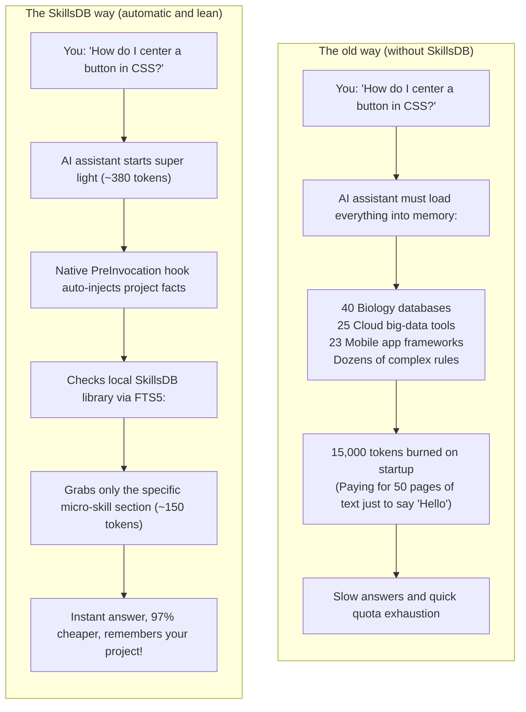
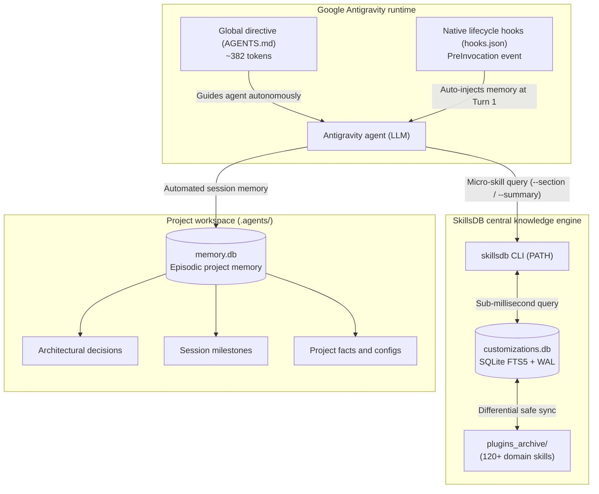
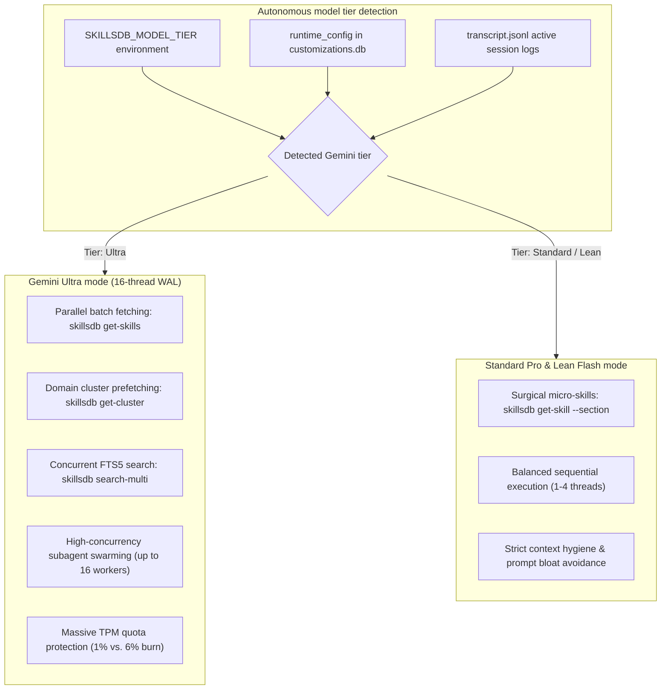

# SkillsDB: Centralized customizations, autonomous memory, and token-efficient knowledge engine for Google Antigravity

[](https://github.com/scorpion421/skillsdb/releases/tag/v2.3.0)
[](https://github.com/scorpion421/skillsdb)
[](https://www.python.org/)
[](https://github.com/PowerShell/PowerShell)
[](https://www.sqlite.org/)
[](https://deepmind.google/)
[](LICENSE)

**SkillsDB** is a knowledge indexing, retrieval, and episodic memory architecture designed for Google Antigravity AI agents. It eliminates static prompt bloat by decoupling enterprise rules and 120+ domain skills into an embedded, on-demand SQLite FTS5 database with native lifecycle hook integration and zero cognitive load.

---

## Overview and core concept

If you are getting started with coding or using AI assistants like Google Antigravity, discussions about *tokens*, *SQLite databases*, and *system prompts* can sound technical. Here is what SkillsDB does in simple terms.

### The backpack metaphor

Imagine hiring an assistant to help you learn programming or build a project:
* **Without SkillsDB**: Every time you ask a simple question like *"How do I change this button color?"*, your assistant is forced to pack **120 heavy encyclopedias** into their backpack (covering mobile frameworks, data science libraries, cloud servers, and corporate rules) before answering you.
  * Result: Your assistant moves slowly, gets confused by irrelevant information, and quickly exhausts your daily AI usage limit.
* **With SkillsDB**: Your assistant carries only a lightweight notebook. When you ask about button styling, the assistant looks up *only* the single page on CSS from a local digital library in milliseconds, answers you immediately, and puts the book back.

---

### How it works: traditional loading vs. SkillsDB


```mermaid
flowchart TD
    subgraph OldWay ["The old way (without SkillsDB)"]
        direction TB
        Q1["You: 'How do I center a button in CSS?'"] --> Step1["AI assistant must load everything into memory:"]
        Step1 --> Books["40 Biology databases\n25 Cloud big-data tools\n23 Mobile app frameworks\nDozens of complex rules"]
        Books --> Burn["15,000 tokens burned on startup\n(Paying for 50 pages of text just to say 'Hello')"]
        Burn --> Slow["Slow answers and quick quota exhaustion"]
    end

    subgraph NewWay ["The SkillsDB way (automatic and lean)"]
        direction TB
        Q2["You: 'How do I center a button in CSS?'"] --> Step2["AI assistant starts super light (~380 tokens)"]
        Step2 --> Hook["Native PreInvocation hook auto-injects project facts"]
        Hook --> Search["Checks local SkillsDB library via FTS5:"]
        Search --> Micro["Grabs only the specific micro-skill section (~150 tokens)"]
        Micro --> Fast["Instant answer, 97% cheaper, remembers your project!"]
    end
```

---

### Key benefits

1. **Avoid AI usage limits**:
   By reducing startup waste by **97.4%** and using micro-skills instead of full document dumps, you can work freely without hitting usage warnings.
2. **Clearer, higher-quality answers**:
   When the AI is not distracted by 100 tools it does not need for your task, its answers are more focused, concise, and easier to understand.
3. **Automatic project memory**:
   SkillsDB automatically remembers your project decisions, facts, and milestones in `.agents/memory.db`. Even in 1,800-step sessions, the agent never forgets past architectural agreements.
4. **Micro-skills engine (-85% retrieval overhead)**:
   Instead of loading a 2,500-token manual, the agent pulls only the specific 150-token recipe, checklist, or diagnostic snippet required.
5. **Zero user friction**:
   You talk to your AI assistant naturally. SkillsDB works invisibly in the background with zero mandatory CLI commands.

---

## The prompt bloat problem in AI coding assistants

By default, Google Antigravity discovers and injects every plugin found in `~/.gemini/config/plugins` into the agent global system prompt on session startup. When developers install standard domain plugins (such as `science`, `flutter`, `data-agent-kit`, `firebase`, etc.), the cumulative token overhead triggers a critical warning:

```text
Customization token budget exceeded. Large customizations will be truncated.
```

### Consequences of static injection
* **Over 15,000 tokens burned** on every single user prompt before work even begins.
* **Context dilution**: The "Lost-in-the-Middle" phenomenon degrades model reasoning when overwhelmed by dozens of irrelevant tools.
* **Excessive latency and cost**: Unnecessary token transmission on every turn consumes API quotas and slows down response times.

---

## On-demand decoupling (-97.4% overhead)

SkillsDB replaces static prompt dumping with an indexed **SQLite knowledge engine** backed by SQLite FTS5 (Full-Text Search) and WAL (Write-Ahead Logging) mode. The agent starts with a lightweight directive (~380 tokens) and fetches domain skills and rules only when the user task requires them.

| Metric | Traditional static loading | SkillsDB architecture | Improvement |
| :--- | :--- | :--- | :--- |
| **Startup prompt overhead** | ~14,813 tokens | **~382 tokens** | **-97.4% reduction** |
| **Available knowledge base** | 120 skills (choking context) | **120 skills** (FTS5 indexed) | **100% capacity preserved** |
| **Skill retrieval cost** | 2,500 tokens (full file) | **~150 tokens** (Micro-Skills) | **-85% retrieval cost** |
| **Multi-turn step efficiency** | 15k tokens per round-trip | **~380 tokens per round-trip** | **~37M+ tokens saved / 2,500 steps** |
| **Scalability limit** | ~10-15 plugins maximum | **10,000+ skills effortlessly** | **Infinite scalability** |

---

## Architecture overview


```mermaid
flowchart TD
    subgraph Antigravity ["Google Antigravity runtime"]
        Agent["Antigravity agent (LLM)"]
        Directive["Global directive (AGENTS.md)\n~382 tokens"]
        Hooks["Native lifecycle hooks (hooks.json)\nPreInvocation event"]
    end

    subgraph CentralEngine ["SkillsDB central knowledge engine"]
        CLI["skillsdb CLI (PATH)"]
        CentralDB[("customizations.db\nSQLite FTS5 + WAL")]
        PluginArchive["plugins_archive/\n(120+ domain skills)"]
    end

    subgraph ProjectWorkspace ["Project workspace (.agents/)"]
        MemDB[("memory.db\nEpisodic project memory")]
        Decisions["Architectural decisions"]
        Snapshots["Session milestones"]
        Facts["Project facts and configs"]
    end

    Directive -->|"Guides agent autonomously"| Agent
    Hooks -->|"Auto-injects memory at Turn 1"| Agent
    Agent -->|"Micro-skill query (--section / --summary)"| CLI
    CLI <-->|"Sub-millisecond query"| CentralDB
    CentralDB <-->|"Differential safe sync"| PluginArchive
    Agent -->|"Automated session memory"| MemDB
    MemDB --> Decisions
    MemDB --> Snapshots
    MemDB --> Facts
```

---

## Autonomous workflow and design principles

The core design principle of SkillsDB is **complete transparency**:

1. **Autonomous knowledge retrieval**:
   The user asks a question in plain natural language (*"Fix this layout overflow in Flutter"*). The agent detects the domain, queries `skillsdb suggest` in milliseconds, retrieves only the relevant micro-skill section, and executes the fix.
2. **Zero-tool-call memory ingestion**:
   Native `PreInvocation` hooks detect the project `.agents/memory.db` and inject facts and recent milestones into the model context as an ephemeral message on Turn 1 with zero tool overhead.
3. **Continuous autonomous learning**:
   Telling the agent *"Remember this convention"* automatically persists it to the database via `skillsdb mem-save-decision` (project) or `skillsdb learn-rule` (global) in the background.
4. **Continuous flow without interruptions**:
   The agent maintains precision across 1,000+ steps without interrupting the developer to restart chats.
5. **Safe, non-destructive updates**:
   Upgrades never overwrite user databases. Custom learned rules and project memories are 100% preserved.

---

## Project-level episodic memory (.agents/memory.db)

To prevent bloating the global database with project-specific trivia while still preserving architectural decisions across sessions, each project maintains an isolated episodic SQLite memory:

* **Autonomous lifecycle**:
  * **Trivial queries** (*"How does this regex work?"*): Memory is bypassed entirely (0 token overhead, no disk footprint).
  * **Non-trivial tasks** (Refactoring, features, long sessions): The agent loads context at task start and records progress snapshots via `skillsdb mem-save-snapshot` upon completion.
* **Zero orphan footprint**: Deleting a project folder deletes its memory database instantly.
* **Auto-pruning (`mem-prune`)**: Automatically reconciles deleted conversation IDs and reclaims disk space with incremental SQLite auto-vacuum.

---

---

## Adaptive model concurrency and Gemini Ultra engine (v2.3.0)

SkillsDB v2.3.0 introduces native runtime awareness for the active Gemini model tier. It dynamically tailors its retrieval strategy between high-throughput multi-threaded batching (for Gemini Ultra) and token-conserving sequential micro-skills (for Gemini Pro and Flash).


```mermaid
flowchart TD
    subgraph Detection ["Autonomous model tier detection"]
        Env["SKILLSDB_MODEL_TIER environment"] --> TierCheck
        Config["runtime_config in customizations.db"] --> TierCheck
        Transcript["transcript.jsonl active session logs"] --> TierCheck
        TierCheck{"Detected Gemini tier"}
    end

    subgraph UltraMode ["Gemini Ultra mode (16-thread WAL)"]
        BatchFetch["Parallel batch fetching: skillsdb get-skills"]
        Cluster["Domain cluster prefetching: skillsdb get-cluster"]
        MultiSearch["Concurrent FTS5 search: skillsdb search-multi"]
        Swarm["High-concurrency subagent swarming (up to 16 workers)"]
        TPMGuard["Massive TPM quota protection (1% vs. 6% burn)"]
    end

    subgraph StandardLean ["Standard Pro & Lean Flash mode"]
        MicroSkills["Surgical micro-skills: skillsdb get-skill --section"]
        Sequential["Balanced sequential execution (1-4 threads)"]
        QuotaSave["Strict context hygiene & prompt bloat avoidance"]
    end

    TierCheck -->|"Tier: Ultra"| UltraMode
    TierCheck -->|"Tier: Standard / Lean"| StandardLean
```

### Why Ultra users need SkillsDB even more

* **Strict TPM & rate limit protection**:
  Gemini Ultra models enforce tighter Tokens Per Minute (TPM) and Requests Per Minute (RPM) limits than standard tiers. Without SkillsDB, every single tool call, lint check, and user prompt carries **14,813 static tokens** of unneeded manuals. Just 4 tool steps within a minute inject almost 60,000 tokens of pure ballast, rapidly triggering rate limits (HTTP 429) or exhausting quota. With SkillsDB, prompt overhead drops to **~382 tokens (-97.4%)**, keeping TPM usage at ~1% instead of 6%.
* **Uncompromised reasoning quality (No Lost-in-the-Middle)**:
  Gemini Ultra possesses superior reasoning and abstraction. Dumping 120 irrelevant skills into context dilutes attention heads. Supplying only the exact micro-skill section needed keeps Ultra focused on deep architecture and code generation.
* **Sub-second parallel batch retrieval**:
  Under SQLite WAL mode (`PRAGMA journal_mode = WAL;`) and thread-safe connection pooling, Ultra models can fetch entire domain toolsets or execute multi-keyword searches simultaneously across up to 16 parallel threads in under 50 milliseconds.

### Gemini Pro vs. Gemini Ultra in SkillsDB: Tier-by-tier comparison

SkillsDB dynamically adapts its retrieval and concurrency engine based on the active model tier:

| Dimension / Capability | Gemini Pro (Standard Tier) | Gemini Ultra (High-Concurrency Tier) | Architectural Rationale & Guidance |
| :--- | :--- | :--- | :--- |
| **Model Profile in SkillsDB** | `standard` (Auto-detected or set via CLI) | `ultra` (Auto-detected or set via CLI) | SkillsDB tailors retrieval strategy dynamically per model tier |
| **Concurrency Pool (SQLite WAL)** | **4 worker threads** | **16 worker threads** (max parallel pool) | Ultra leverages 4x higher parallel connection concurrency |
| **Skill Retrieval Strategy** | **Sequential micro-skills** (`--section`) | **Parallel batching & domain clusters** | Pro conserves tokens; Ultra fetches whole toolsets in <50ms |
| **Batch Commands Supported** | Single skill fetch (`skillsdb get-skill`) | Batch fetch (`skillsdb get-skills`, `get-cluster`) | Ultra loads entire toolsets (`flutter`, `data`) in 1 turn |
| **FTS5 Search Execution** | Single query search (`skillsdb search`) | Concurrent multi-query (`search-multi`) | Ultra searches multiple topics/domains in parallel |
| **Subagent Swarming Capacity** | 2 to 4 parallel background workers | **8 to 16 parallel background workers** | Ultra orchestrates wide multi-agent exploration swarms |
| **Prompt Bloat Reduction** | **~382 tokens** (-97.4% reduction) | **~382 tokens** (-97.4% reduction) | Both tiers enjoy identical 97.4% prompt bloat elimination |
| **Context Memory Architecture** | `.agents/memory.db` (episodic storage) | `.agents/memory.db` (episodic storage) | Both tiers maintain continuous memory across 1,000+ turns |
| **API Token Cost Rate** | ~$2.00 / 1M input tokens | ~$7.50 to $10.00 / 1M input tokens | Ultra tokens are ~4x to 5x more valuable to conserve |
| **Cumulative Savings (7,000 turns)**| **~$203.75 USD saved** | **~$764.07 to $1,018.76 USD saved** | Saving prompt bloat yields 4x higher dollar ROI on Ultra |
| **Quota Impact (TPM & Daily)** | Keeps Pro within standard TPM limits | **Protects strict Ultra TPM (1% vs. 6% burn)** | Prevents HTTP 429 throttling and preserves daily Ultra quota |
| **Ideal Workloads & Use Cases** | Day-to-day coding, unit tests, fast bugs | Complex architectures, large refactors, swarms | Choose Pro for light speed; Ultra for deep reasoning power |

### Ultra-to-Ultra head-to-head: Gemini Ultra without SkillsDB vs. with SkillsDB v2.3.0

Running Gemini Ultra without SkillsDB severely handicaps the model's true potential. The following table illustrates the direct head-to-head comparison on the Ultra model:

| Capability / Metric | Gemini Ultra (Static Plugin Loading) | Gemini Ultra with SkillsDB v2.3.0 | Real-World Advantage for Ultra Users |
| :--- | :--- | :--- | :--- |
| **Startup Prompt Overhead** | ~14,813 tokens injected on every turn | **~382 tokens** (-97.4% reduction) | 14,430 tokens freed up on every single model turn |
| **TPM Rate Limit Impact (4 calls/min)** | ~59,250 tokens/min burned on prompts | **~1,530 tokens/min** burned on prompts | **Eliminates HTTP 429 rate limit throttling** |
| **Daily Quota Consumption** | ~6% quota consumed per typical task | **~1% actual quota consumption** | **83% quota preserved** for coding and reasoning |
| **Reasoning Focus (Attention Heads)** | Diluted by 120 unused tool definitions | **100% focused** on project code and active tools | **Prevents Lost-in-the-Middle reasoning degradation** |
| **Domain Knowledge Retrieval** | Static text only (frozen in prompt) | **Sub-50ms parallel batching (16 threads)** | Instant domain clusters (`flutter`, `data`, etc.) |
| **Multi-Query FTS5 Search** | Not possible (manual grep/scan) | **Concurrent multi-query search (`search-multi`)** | Parallel discovery across 120+ skills and rules |
| **Multi-Agent Swarming (8 workers)** | ~120,000 tokens burned on spawn | **~3,050 tokens total** across all 8 workers | Enables true high-concurrency subagent swarms |
| **Session Lifespan Before Compaction** | Context compacted at step 80 - 90 | **1,180+ steps sustained** without degradation | **13x longer effective project session lifespan** |
| **Cumulative Cost of Overhead (7,000 turns)** | ~$764.07 to $1,018.76 USD wasted | **$0.00 USD wasted on static prompts** | Every cent invested into actual problem solving |
| **Continuous Memory Across Turns** | Lost upon chat compaction / restart | **Permanent episodic memory (`.agents/memory.db`)** | Seamless project continuity without chat restarts |

---

## Real-world production benchmarks: 7,000+ turns and 100M+ tokens saved

SkillsDB tracks verified production performance across actual Antigravity development sessions:

| Metric | Traditional static setup | SkillsDB production metrics | Real-world impact |
| :--- | :--- | :--- | :--- |
| **Tracked production sessions** | N/A | **29 active sessions** | Measured across real-world workflows |
| **Total model turns executed** | N/A | **7,060 turns (7,420 steps)** | High-iteration pair programming |
| **Cumulative prompt bloat avoided** | 0 tokens (full burn) | **101,875,800 tokens** | **~101.9 million tokens saved** |
| **Cost saved (Gemini Pro rate)** | $0.00 | **~$203.75 USD** | Calculated at $2.00 / 1M input tokens |
| **Cost saved (Gemini Ultra rate)** | $0.00 | **~$764.07 to $1,018.76 USD** | Calculated at $7.50 to $10.00 / 1M tokens |
| **Single-session endurance (this chat)** | Compaction at step 90 | **1,180+ steps sustained** | **16.38M tokens saved ($122.84 USD)** |
| **Context amnesia threshold** | Step 80 - 90 (~15k tokens/turn) | **Step 417** (~382 tokens/turn) | **4.6x longer session lifespan** |
| **Overshoot past compaction limit** | 0 steps (hallucinations begin) | **+392 to +700+ steps** | **Zero knowledge loss via .agents/memory.db** |
| **Quota consumption impact** | ~6% daily burn for basic tasks | **~1% actual quota consumption** | **83% reduction in quota consumption** |

### What this proves in practice
1. **Extended working window**: Because the system prompt is 97.4% leaner, developers complete hours of deep iterative refactoring without hitting context compaction.
2. **True continuous flow**: When compaction inevitably occurs in long-running projects, `.agents/memory.db` preserves architectural decisions, file snapshots, and rules seamlessly. The agent never prompts the developer to restart or switch chats.
3. **Rock-solid survivability**: Even across live plugin upgrades, Windows manifest injection, and application restarts, no context or customizations were lost.

---

## Safe, non-destructive updates

SkillsDB includes an automated differential merge engine to keep workstations up to date without ever losing user customizations:

* **Automatic pre-update backup**: Creates a timestamped safety backup (`customizations.db.bak_YYYYMMDD_HHMMSS`) before any modifications.
* **Differential SQLite merge**: Using SQLite `ATTACH DATABASE`, official skills and rules are updated, while **100% of user-learned rules (`category = 'learned'`) and custom skills are preserved**.
* **Safety audit and rollback**: Validates that all user-learned rules remain intact after merge; automatically rolls back if any discrepancy is detected.
* **Untouched project memory**: Local `.agents/memory.db` files in workspace repositories are never touched during global updates.

---

## Quick start and installation

### Option 1: One-command deployment via Antigravity agent
Simply clone the repository and tell your Antigravity agent:
> **"Please deploy Antigravity customizations from this repository"**

### Option 2: Automated script deployment

#### Windows (PowerShell)
```powershell
powershell -ExecutionPolicy Bypass -File .\deploy.ps1
```

#### Cross-platform (Python)
```bash
python deploy.py
```

The script automatically:
1. Deploys `customizations.db` to `~/.gemini/database/`.
2. Installs the `skillsdb` CLI to `~/.gemini/antigravity/bin/` (in your system PATH).
3. Configures `customizations-db` with native lifecycle hooks in `~/.gemini/config/plugins/`.
4. Safely moves static legacy plugins to `~/.gemini/plugins_archive/` (eliminating prompt bloat).

---

## CLI reference guide

The global `skillsdb` command is accessible from any terminal and working directory:

### 1. Rules, skills, and diagnostics
```powershell
# Display all active system rules
skillsdb get-active-rules

# Auto-suggest the best matching skills for a task
skillsdb suggest "Flutter widget layout overflow"

# Retrieve full instructions for a specific skill
skillsdb get-skill admin-elevation

# Micro-skills: inspect outline and section list (~80 tokens)
skillsdb get-skill flutter-fix-layout-issues --summary

# Micro-skills: load only a specific section (~150 tokens, saving 85% context)
skillsdb get-skill flutter-fix-layout-issues --section "Fixing RenderFlex Overflow"

# Autonomous learning: persist a learned rule globally into SQLite
skillsdb learn-rule "python-standards" "Python Guidelines" "Always use typing and dataclasses."

# Full-text search across all rules and 120 skills
skillsdb search "bigquery"

# Run system health diagnostics (DB integrity, PATH, hooks, git ignore)
skillsdb doctor

# View database statistics and measured token/cost savings
skillsdb stats

# Check for updates on GitHub (version comparison and changelog)
skillsdb check-update

# Safely update SkillsDB to latest release (zero data loss via differential merge)
skillsdb update

# Configure Antigravity to run natively with UTF-8 process code page on Windows
skillsdb fix-utf8

# Check Antigravity UTF-8 manifest status
skillsdb fix-utf8 --check
```

### 2. Project memory (.agents/memory.db)
```powershell
# Retrieve recent project context (decisions + latest milestone, ~150 tokens)
skillsdb mem-get-context

# Save an architectural decision
skillsdb mem-save-decision "API HTTPS Port" "Use Port 5001 with JWT authentication"

# Save a session milestone snapshot
skillsdb mem-save-snapshot "Migrated authentication middleware" --next-steps "Write integration tests"

# Save a key-value configuration fact
skillsdb mem-save-fact "DB_HOST" "sql01.internal.local"

# Full-text search within project memory
skillsdb mem-search "JWT"

# Prune deleted conversations and vacuum database
skillsdb mem-prune
```

### 3. Database management and team synchronization
```powershell
# Re-index all skills from global and archived plugins
skillsdb import-all

# Import any Markdown rule or skill file
skillsdb import-file "path/to/custom_skill.md"

# Push local database updates to network team share
skillsdb sync push

# Pull latest team database updates from network share
skillsdb sync pull
```

### 4. Adaptive model concurrency and Ultra batching (v2.3.0)
```powershell
# View active model profile and concurrency settings
skillsdb profile

# Set model profile explicitly (ultra, standard, lean, or auto)
skillsdb profile set ultra
skillsdb profile set standard
skillsdb profile auto     # Reset to automatic transcript/runtime detection

# Retrieve multiple skills concurrently in 1 batch call (up to 16 parallel threads)
skillsdb get-skills flutter-apply-architecture-best-practices flutter-add-widget-test --summary
skillsdb get-skills bigquery-sql dataform-bigquery --workers 8

# Prefetch an entire pre-indexed domain cluster concurrently
# Supported clusters: flutter, android, data, firebase, web, admin, security
skillsdb get-cluster flutter --summary
skillsdb get-cluster data --json
skillsdb get-cluster firebase --workers 16

# Execute multiple full-text search queries concurrently across 120+ skills
skillsdb search-multi "bigquery optimization" "firebase auth" "docker container"
skillsdb search-multi "hot reload" "widget test" --limit 3 --json

# Benchmark sequential vs. parallel multi-threaded retrieval throughput
skillsdb benchmark-concurrency --queries 20 --workers 16

# View database statistics and measured token savings with Gemini Ultra cost breakdown
skillsdb stats --savings
```

---

## Windows UTF-8 encoding fix

On Windows, applications without an explicit application manifest fall back to the legacy Windows ANSI code page (CP1252 / Western European Latin-1). In long multi-turn sessions with German or international text, this can cause UTF-8 multi-byte characters (such as umlauts) to display as mojibake (`ä`, `ö`, `ü`, `ß`).

SkillsDB provides an automated, non-invasive fix specifically for Google Antigravity:
```powershell
skillsdb fix-utf8
```

### What `skillsdb fix-utf8` does
* **Application manifests**: Deploys `Antigravity.exe.manifest` and `language_server.exe.manifest` with `<activeCodePage>UTF-8</activeCodePage>`.
* **Zero system disruption**: Does not alter global Windows region settings or require an operating system reboot.
* **Environment defaults**: Configures standard UTF-8 environment variables (`PYTHONUTF8=1`, `PYTHONIOENCODING=utf-8`, `LANG=de_DE.UTF-8`) in the user profile.
* **Health diagnosis**: Automatically verified and reported by `skillsdb doctor`.

---

## Global system rules

All Antigravity agents running with SkillsDB adhere to 7 core directives:

1. **Universal formatting invariants**: Strictly no em-dashes (Unicode U+2014) or en-dashes (Unicode U+2013); strictly no emojis.
2. **Communication**: Informal German ("Du", never "Sie") with natural German spelling including umlauts (ä, ö, ü, ß). Strictly no Deppenbindestriche in German compound words.
3. **Scripting standards**: Professional English code, comments, and outputs (ASCII only); proper error handling; strictly no VBScript.
4. **Admin elevation**: Seamless execution with elevated administrator privileges using encrypted Windows DPAPI credentials without interactive UAC prompts.
5. **Token efficiency**: Strict context hygiene (line-sliced file views, bounded command outputs, subagent isolation for wide searches, concise responses).
6. **Autonomous project memory and continuous flow**: Persistent episodic memory across sessions; autonomous micro-skill routing and snapshotting; zero chat-switching interruptions.
7. **Adaptive model concurrency protocol**: Autonomous detection of model tier (`ultra`, `standard`, `lean`); 16-thread parallel batch fetching and cluster prefetching for Ultra; compact sequential micro-skills for Standard/Lean.

---

## Project structure

```text
SkillsDB/
├── .agents/                    # Project-level episodic memory (.agents/memory.db)
├── database/
│   ├── customizations.db       # Central SQLite database (120 skills, 10 rules, FTS5 + WAL)
│   └── db_manager.py           # Core CLI engine, micro-skills, concurrency, and safe update manager
├── plugin/
│   ├── plugin.json             # Antigravity plugin manifest
│   ├── hooks.json              # Native PreInvocation lifecycle hook
│   ├── rules/
│   │   └── AGENTS.md           # Minimal ~380-token system prompt directive
│   └── skills/
│       └── customizations-db/  # Customization DB interface skill (with CLI guide)
├── tests/
│   ├── test_autonomous.py      # Automated unit test suite (differential merge, hooks, etc.)
│   └── test_ultra_concurrency.py # High-concurrency, model tier, and WAL parallel test suite
├── deploy.ps1                  # PowerShell automated deployment script (Windows)
├── deploy.py                   # Python automated deployment script (Cross-platform)
├── .gitignore                  # Git hygiene configuration
└── README.md                   # System documentation
```

---

## License

This project is licensed under the [MIT License](LICENSE).
