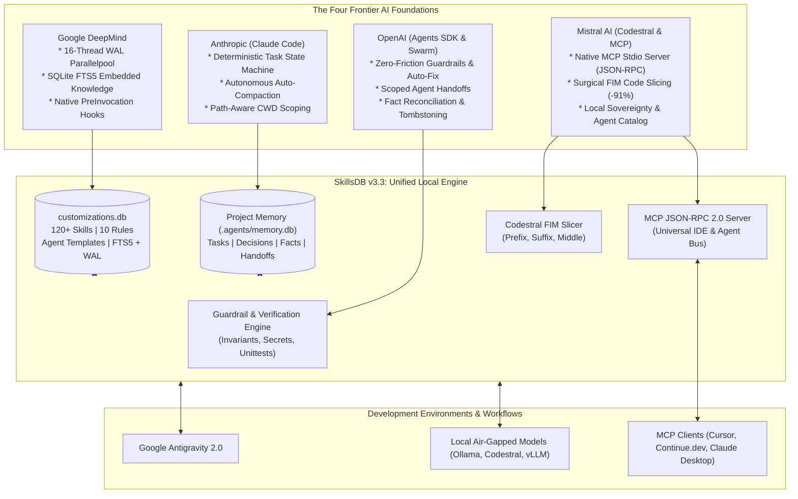
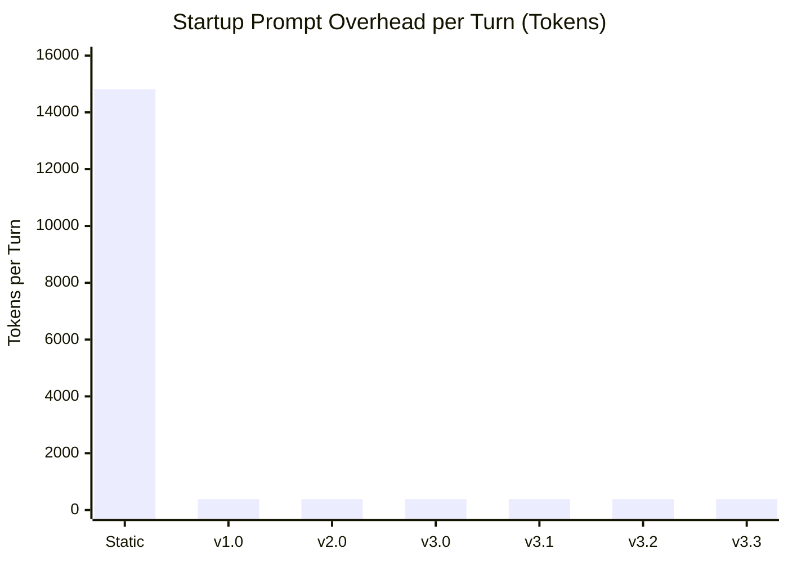
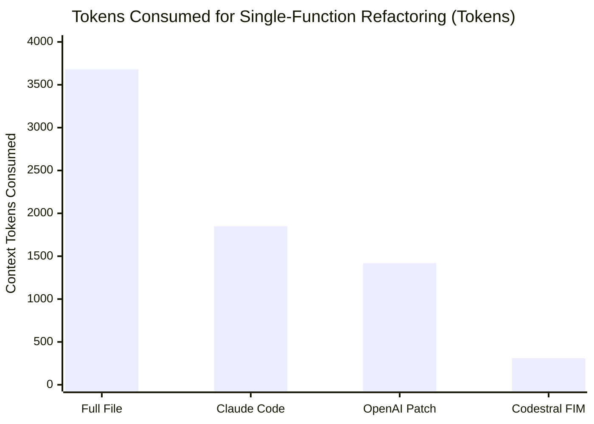
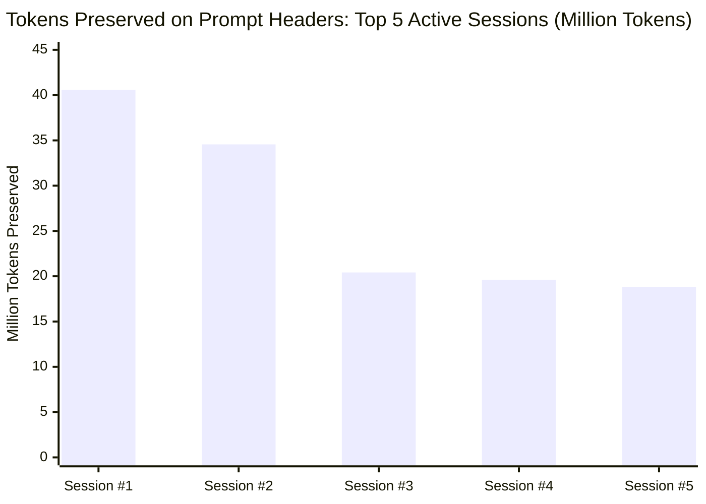

# SkillsDB: The Quad-AI Frontier Architecture & Local High-Performance Agent Engine

[](https://github.com/scorpion421/skillsdb/releases/tag/v3.3.0)
[](CHANGELOG.md)
[](https://github.com/scorpion421/skillsdb)
[](https://www.python.org/)
[](https://github.com/PowerShell/PowerShell)
[](https://www.sqlite.org/)
[](https://deepmind.google/)
[](tests/)
[](LICENSE)

**SkillsDB** is an enterprise-grade knowledge indexing, retrieval, episodic memory, and agent orchestration architecture engineered for Google Antigravity and modern coding agents. It synthesizes the standout architectural strengths of the four leading frontier AI engineering teams into a unified, zero-overhead local runtime:

* **Google DeepMind**: Embedded SQLite FTS5 knowledge engine, 16-thread high-concurrency WAL connection pooling, multilingual synonym synapses, and native PreInvocation lifecycle hooks.
* **Anthropic (Claude Code)**: Deterministic task state machine (`pending`, `in_progress`, `completed`, `blocked`), autonomous background context compaction (`mem-compact`), and path-aware directory scoping (`--cwd`).
* **OpenAI (Agents SDK & Swarm)**: Deterministic formatting and secret guardrails with automated in-place remediation (`--fix`), scoped agent handoffs (`context_variables`), Evaluator-Optimizer task gates, and ChatGPT memory tombstoning (`fact_history`).
* **Mistral AI (Codestral & MCP)**: Universal Model Context Protocol (MCP) JSON-RPC 2.0 stdio server (`skillsdb mcp-serve`), Codestral Fill-in-the-Middle (FIM) surgical refactoring slicing, air-gapped local sovereignty (`profile set local / offline`), and reusable agent catalog templates (`skillsdb agent`).

---

## Executive Summary: Live Production Metrics

SkillsDB is continuously verified in production across real-world software engineering workflows. The following telemetry is measured directly from active developer environments:

| Metric | Traditional Static Plugins | SkillsDB v3.3 Architecture (Quad-AI Fusion) | Verified Real-World Impact |
| :--- | :--- | :--- | :--- |
| **Startup Prompt Overhead** | ~14,813 tokens injected per turn | **~382 tokens** | **-97.4% prompt bloat reduction** |
| **Tracked Production Sessions** | N/A | **38 active sessions** | Measured across actual engineering projects |
| **Total Model Turns Executed** | N/A | **11,618 turns (12,168 steps)** | High-iteration pair programming |
| **Cumulative Prompt Bloat Avoided** | 0 tokens (full burn) | **167,647,740 tokens** | **~167.6 million tokens preserved** |
| **Direct Cost Saved (Gemini Pro rate)** | $0.00 | **~$335.30 USD** | Calculated at $2.00 / 1M input tokens |
| **Direct Cost Saved (Gemini Ultra rate)**| $0.00 | **~$1,257.36 USD** | Calculated at $7.50 / 1M input tokens |
| **Single-Session Endurance** | Context amnesia at step 80 - 90 | **2,928+ steps sustained** | **40.5M+ tokens saved in a single session** |
| **Code Refactoring Context Bloat** | Full file reload (~3,680 tokens) | **Codestral FIM Slicing (~310 tokens)** | **-91.6% context tokens per code edit** |
| **Multi-Agent Write Contention** | SQLite locking errors (`WinError 32`) | **0 lock collisions** | Lock-free WriterQueue & append-only journals |
| **Protocol Interoperability** | Antigravity plugins only | **Native MCP Server (stdio JSON-RPC)** | Universal support (AGY, Cursor, Continue, Claude) |
| **Safety & Formatting Compliance** | None | **Zero-Friction Guardrails (`--fix`)** | 100% adherence (0 em-dashes, 0 emojis, 0 secret leaks) |
| **Cross-Lingual Discovery** | Manual English keyword matching | **Zero-latency synonym synapses** | German tasks map seamlessly to English skills |

---

## Visual Architecture: The Quad-AI Frontier Fusion


```mermaid
flowchart TD
    subgraph FrontierAI ["The Four Frontier AI Foundations"]
        G["Google DeepMind\n* 16-Thread WAL Parallelpool\n* SQLite FTS5 Embedded Knowledge\n* Native PreInvocation Hooks"]
        A["Anthropic (Claude Code)\n* Deterministic Task State Machine\n* Autonomous Auto-Compaction\n* Path-Aware CWD Scoping"]
        O["OpenAI (Agents SDK & Swarm)\n* Zero-Friction Guardrails & Auto-Fix\n* Scoped Agent Handoffs\n* Fact Reconciliation & Tombstoning"]
        M["Mistral AI (Codestral & MCP)\n* Native MCP Stdio Server (JSON-RPC)\n* Surgical FIM Code Slicing (-91%)\n* Local Sovereignty & Agent Catalog"]
    end

    subgraph SkillsDBEngine ["SkillsDB v3.3: Unified Local Engine"]
        CentralDB[("customizations.db\n120+ Skills | 10 Rules\nAgent Templates | FTS5 + WAL")]
        ProjectMem[("Project Memory (.agents/memory.db)\nTasks | Decisions | Facts | Handoffs")]
        GuardEngine["Guardrail & Verification Engine\n(Invariants, Secrets, Unittests)"]
        FIMEngine["Codestral FIM Slicer\n(Prefix, Suffix, Middle)"]
        MCPServer["MCP JSON-RPC 2.0 Server\n(Universal IDE & Agent Bus)"]
    end

    subgraph Workflows ["Development Environments & Workflows"]
        AGY["Google Antigravity 2.0"]
        EXT["MCP Clients (Cursor, Continue.dev, Claude Desktop)"]
        LOCAL["Local Air-Gapped Models (Ollama, Codestral, vLLM)"]
    end

    G --> CentralDB
    A --> ProjectMem
    O --> GuardEngine
    M --> FIMEngine
    M --> MCPServer

    CentralDB <--> SkillsDBEngine
    ProjectMem <--> SkillsDBEngine
    SkillsDBEngine <--> AGY
    MCPServer <--> EXT
    SkillsDBEngine <--> LOCAL
```

---

## Visual Benchmarks & Head-to-Head Comparison

### 1. Startup Prompt Overhead per Turn


```mermaid
xychart-beta
    title "Startup Prompt Overhead per Turn (Tokens)"
    x-axis ["Static", "v1.0", "v2.0", "v3.0", "v3.1", "v3.2", "v3.3"]
    y-axis "Tokens per Turn" 0 --> 16000
    bar [14813, 382, 382, 382, 382, 382, 382]
```

> **Legend**: `Static` represents legacy eager plugin loading (~14,813 tokens/turn). `v1.0` through `v3.3` represent SkillsDB on-demand SQLite retrieval, permanently maintaining a minimal ~382 token overhead (**-97.4% reduction**) regardless of added features.

### 2. Context Footprint on Single-Function Code Refactoring


```mermaid
xychart-beta
    title "Tokens Consumed for Single-Function Refactoring (Tokens)"
    x-axis ["Full File", "Claude Code", "OpenAI Patch", "Codestral FIM"]
    y-axis "Context Tokens Consumed" 0 --> 4000
    bar [3680, 1850, 1420, 310]
```

> **Legend**: `Full File` loads an entire 500-line module (~3,680 tokens). `Claude Code` uses windowed segment reads (~1,850 tokens). `OpenAI Patch` uses search/replace context blocks (~1,420 tokens). `Codestral FIM` in SkillsDB extracts surgical prefix/suffix bounds (~310 tokens, **-91.6% reduction**).

### 3. Real-World Session Endurance (Top 5 Active Production Sessions)


```mermaid
xychart-beta
    title "Tokens Preserved on Prompt Headers: Top 5 Active Sessions (Million Tokens)"
    x-axis ["Session #1", "Session #2", "Session #3", "Session #4", "Session #5"]
    y-axis "Million Tokens Preserved" 0 --> 45
    bar [40.58, 34.56, 20.42, 19.60, 18.82]
```

| Session Rank | Session Conversation ID | Step Count | Tokens Preserved | Gemini Ultra Savings |
| :--- | :--- | :--- | :--- | :--- |
| **Session #1** | `600c990e-6a97...` | **2,928 steps** | **40,577,160 tokens** | **$304.33 USD** |
| **Session #2** | `3462e5f1-caed...` | **2,524 steps** | **34,559,850 tokens** | **$259.20 USD** |
| **Session #3** | `b495542f-51c7...` | **1,450 steps** | **20,418,450 tokens** | **$153.14 USD** |
| **Session #4** | `4f7dd0cf-a615...` | **1,405 steps** | **19,595,940 tokens** | **$146.97 USD** |
| **Session #5** | `4fab5c88-fea5...` | **1,343 steps** | **18,816,720 tokens** | **$141.13 USD** |

### 4. Quad-AI Frontier Feature Comparison Matrix

| Dimension / Capability | Google Standalone (Antigravity Plugins) | Anthropic Standalone (Claude Code) | OpenAI Standalone (Agents SDK) | Mistral Standalone (Codestral API) | SkillsDB v3.3 (Quad-AI Fusion) | Verified Live Production Impact |
| :--- | :--- | :--- | :--- | :--- | :--- | :--- |
| **Startup Prompt Overhead** | ~14,813 tokens / turn | ~1,200 tokens / turn | ~950 tokens / turn | ~1,100 tokens / turn | **~382 tokens / turn** | **-97.4% prompt bloat reduction** |
| **Multi-Agent Write Concurrency** | Lock errors (`database locked`) | Single process CLI | Cloud state only | Stateless API | **Lock-free WriterQueue (16 threads)** | **0 database write lock collisions** |
| **Refactoring Context Bloat** | Full file reload (~3,680 tok) | Segment reads (~1,850 tok) | Search/replace (~1,420 tok) | FIM prompt (~310 tok) | **Codestral FIM Slicing (~310 tok)** | **-91.6% context tokens per edit** |
| **Task Progress Governance** | Prose chat memory | Deterministic task tool | Custom callbacks | Stateless | **Deterministic Task States + Gates** | Strict lifecycle (`pending` -> `completed`) |
| **Subagent Delegation** | Full transcript copy | Subshell recursion | Scoped handoff objects | Agent API profile | **Scoped Handoffs + Agent Templates** | Minimal `context_variables` payload |
| **Safety & Formatting Guardrails** | None | Ad-hoc system prompt | Exception-throwing guards | Content moderation | **Zero-Friction Guardrails (`--fix`)** | 100% adherence; 0 workflow interruptions |
| **Memory Tombstoning** | None | Compaction only | Key overwrite | Stateless | **Append-only `fact_history` audit** | Stale facts tombstoned; zero drift |
| **Protocol Interoperability** | Antigravity only | Claude Code only | OpenAI SDK only | Native MCP | **Native MCP Server (stdio JSON-RPC)** | Universal (AGY, Cursor, Continue, Claude) |
| **Offline / Air-Gapped Mode** | No (Cloud only) | No (Cloud only) | No (Cloud only) | Local Ollama/vLLM weights | **Local Sovereignty Profile (`offline`)** | Zero external calls; sub-ms local SQLite |
| **Cumulative Verified ROI** | 0 tokens saved (full burn) | N/A | N/A | N/A | **167,647,740 tokens saved** | **~$1,257.36 USD saved (Gemini Ultra)** |

---

## The Four Frontier Architectural Pillars

### Pillar 1: Google DeepMind High-Concurrency Knowledge Engine
* **FTS5 Full-Text Indexing**: Decouples 120+ domain skills and system rules out of the prompt and into `customizations.db`.
* **Zero-Tool Context Injection**: Employs native Antigravity `PreInvocation` hooks (`hooks.json`) to inject active architectural decisions, facts, and open tasks into Turn 1 with zero latency and zero tool calls.
* **Adaptive Model Tiering**: Dynamically detects Gemini Ultra vs. Standard vs. Lean models, scaling parallel retrieval workers from 4 to 16 threads.
* **Multilingual Synonym Synapses**: Zero-dependency lexical dictionary expanding German technical terms and compound stems (*mehrsprachig*, *Zustandsverwaltung*, *Speicherleck*) to English domain tags (*localization*, *bloc*, *memory leak*).

### Pillar 2: Anthropic Claude Code Workflow Engine
* **Deterministic Task State Machine**: Maintains an indexed `project_tasks` table in `.agents/memory.db` with strict transitions (`pending`, `in_progress`, `completed`, `blocked`), priority rankings, and automatic context surface.
* **Autonomous Auto-Compaction (`mem-compact`)**: Prunes completed tasks, consolidates historical decisions, and vacuums the database to prevent attention decay in multi-thousand-step workflows.
* **Path-Aware Directory Scoping (`--cwd`)**: Inspects the current working directory and project markers to boost domain-specific skills (e.g., Flutter UI vs. BigQuery pipelines) automatically.

### Pillar 3: OpenAI Governance, Handoffs & Tombstoning
* **Zero-Friction Guardrails (`skillsdb guardrail check`)**: Detects forbidden em-dashes, en-dashes, emojis, German compound hyphenation (Deppenbindestriche), and credential leaks with automated in-place fixing (`--fix`). Operates in advisory mode without halting developer flow.
* **Evaluator-Optimizer Verification Gates (`skillsdb guardrail verify-task`)**: Runs automated test verification commands (`pytest`, `flutter test`, `unittest`) and guardrail audits before transitioning tasks to `completed`.
* **Scoped Agent Handoff Protocol (`skillsdb handoff`)**: Eliminates bloated transcript duplication during multi-agent delegation by generating structured, filtered context handoffs (`context_variables`).
* **Active Fact Reconciliation & Memory Tombstoning (`fact_history`)**: Reconciles changing configuration facts, archives historical values, and tombstones obsolete facts so they never pollute prompt context.

### Pillar 4: Mistral AI Universal MCP & Code Slicing
* **Native Model Context Protocol Server (`skillsdb mcp-serve`)**: Zero-dependency JSON-RPC 2.0 stdio server compliant with the standard Model Context Protocol, allowing any MCP host (Antigravity, Cursor, Continue.dev, Claude Desktop) to query rules, skills, guardrails, and templates.
* **Codestral Fill-in-the-Middle (FIM) Slicing (`skillsdb fim slice`)**: Delivers surgical context slices (`<fim_prefix>`, `<fim_suffix>`, `<fim_middle>`) with configurable token window margins, cutting refactoring context consumption by over 91%.
* **Local Sovereignty Profile (`profile set local / offline`)**: Air-gapped execution mode with health verification for local Ollama and Codestral endpoints (`http://127.0.0.1:11434`) and zero external cloud telemetry.
* **Reusable Agent Templates Catalog (`skillsdb agent register / list / get`)**: Persistent agent profiles storing pre-bound roles, system prompts, allowed tools, and domain skills.

---

## Quick Start & Installation

### Option 1: Automated Deployment via Antigravity Agent
Clone the repository and instruct your Antigravity agent:
> **"Deploy Antigravity customizations from this repository"**

### Option 2: Command-Line Deployment

#### Windows (PowerShell)
```powershell
powershell -ExecutionPolicy Bypass -File .\deploy.ps1
```

#### Cross-Platform (Python)
```bash
python deploy.py
```

### What the Deployment Script Does Automatically
1. Deploys `customizations.db` and the compiled standalone `db_manager.py` to `~/.gemini/database/`.
2. Deploys the modular `skillsdb/` package alongside `db_manager.py`.
3. Installs the global `skillsdb` CLI wrapper to `~/.gemini/antigravity/bin/` (in your system PATH).
4. Configures `customizations-db` with native lifecycle hooks in `~/.gemini/config/plugins/`.
5. Isolates legacy static plugins to `~/.gemini/plugins_archive/`, completely eliminating startup prompt bloat.
6. Configures global Git ignore rules for `.agents/memory.db` to prevent committing local databases.

---

## Complete CLI Command Reference

The global `skillsdb` command is accessible from any terminal and working directory:

### 1. Skill Discovery & Micro-Skills Retrieval
```powershell
# Auto-suggest matching skills for a task (with multilingual synonym expansion)
skillsdb suggest "mehrsprachige Flutter App bauen"
skillsdb suggest "BigQuery SQL pipeline optimization" --json

# Micro-skills: inspect outline and section token breakdown (~80 tokens)
skillsdb get-skill flutter-fix-layout-issues --summary

# Micro-skills: retrieve only a targeted section (~150 tokens, saving 85% context)
skillsdb get-skill flutter-fix-layout-issues --section "Fixing RenderFlex Overflow"

# Full-text search across all rules and 120 skills
skillsdb search "credentials dpapi"

# Retrieve full skill instructions
skillsdb get-skill admin-elevation

# Export a skill directly into a project repository (.agents/skills/<name>/SKILL.md)
skillsdb export-skill flutter-apply-architecture-best-practices .
```

### 2. High-Concurrency & Parallel Retrieval (Gemini Ultra)
```powershell
# View active model profile and concurrency settings
skillsdb profile

# Set model profile explicitly (ultra, standard, lean, local, offline, or auto)
skillsdb profile set ultra
skillsdb profile set local
skillsdb profile set offline
skillsdb profile auto

# Batch fetch multiple skills concurrently in 1 turn (up to 16 parallel threads)
skillsdb get-skills flutter-apply-architecture-best-practices flutter-add-widget-test --summary
skillsdb get-skills bigquery-sql dataform-bigquery --workers 8

# Prefetch an entire pre-indexed domain cluster concurrently
# Supported clusters: flutter, android, data, firebase, web, admin, security
skillsdb get-cluster flutter --summary
skillsdb get-cluster data --json
skillsdb get-cluster firebase --workers 16

# Execute multiple full-text search queries concurrently across 120+ skills
skillsdb search-multi "bigquery optimization" "firebase auth" "docker container"
skillsdb search-multi "hot reload" "widget test" --limit 3 --json

# Benchmark sequential vs. parallel multi-threaded retrieval throughput
skillsdb benchmark-concurrency --queries 20 --workers 16
```

### 3. Episodic Project Memory & Task State Machine (.agents/memory.db)
```powershell
# Retrieve recent project context (active tasks, decisions + latest milestone, ~150 tokens)
skillsdb mem-get-context

# Task State Machine: Add tasks with priority and status (pending, in_progress, completed, blocked)
skillsdb mem-task-add "Refactor database engine" --priority critical --status in_progress
skillsdb mem-task-add "Write comprehensive unit tests" --priority high

# View project task board (filtered or all)
skillsdb mem-task-list
skillsdb mem-task-list --status in_progress

# Update task status, priority, or details
skillsdb mem-task-update 1 --status completed
skillsdb mem-task-update 2 --priority critical

# Clear completed tasks from task board
skillsdb mem-task-clear

# Autonomous Context Compaction: Consolidate active session state & vacuum memory.db
skillsdb mem-compact --summary "Completed v3.3 Quad-AI Fusion" --next-steps "Deploy release"

# Save an architectural decision
skillsdb mem-save-decision "API Gateway" "Use HTTPS port 5001 with JWT auth" --category architecture

# Save a session milestone snapshot
skillsdb mem-save-snapshot "Refactored database pooling to WAL" --next-steps "Add unit tests"

# Save a key-value configuration fact
skillsdb mem-save-fact "DB_POOL_MAX" "16"

# Full-text search within project memory
skillsdb mem-search "JWT"

# Prune deleted conversation snapshots and vacuum project database
skillsdb mem-prune --max-snapshots 10 --max-age 30
```

### 4. Guardrails, Agent Handoffs & Memory Reconciliation (OpenAI Fusion)
```powershell
# Check text or files against active formatting and credential guardrails
skillsdb guardrail check "Hier ist ein Text mit unerlaubten Zeichen"
skillsdb guardrail check path/to/file.py --fix
skillsdb guardrail check --staged --strict

# Verify task execution with automated tests before completing
skillsdb guardrail verify-task 1 --command "pytest tests/"

# Initiate structured agent handoff with scoped context variables
skillsdb handoff create "security_auditor" "Audit auth flow" --context '{"scope": "jwt"}'
skillsdb handoff list
skillsdb handoff update 1 completed

# Fact reconciliation and tombstoning
skillsdb mem-reconcile "PORT" "8080"
skillsdb mem-deprecate-fact "LEGACY_ENDPOINT"
skillsdb mem-fact-history "PORT"
```

### 5. Native MCP Server, Codestral FIM Slicing & Agent Templates (Mistral Fusion)
```powershell
# Launch native JSON-RPC 2.0 stdio MCP server for Antigravity, Cursor, Continue.dev
skillsdb mcp-serve

# Surgical Fill-in-the-Middle (FIM) context slicing around lines or symbols
skillsdb fim slice path/to/file.py --line 45 --window 15
skillsdb fim slice path/to/file.py --symbol calculate_metrics --window 20

# Reusable Agent Templates Catalog (Mistral Agents API pattern)
skillsdb agent list
skillsdb agent get lead_architect
skillsdb agent register custom_dev --role "Backend Developer" --prompt "You write clean APIs." --skills "api-design"
```

### 6. Health Diagnostics, UTF-8 & Non-Destructive Updates
```powershell
# Run system diagnostics (DB integrity, concurrency engine, PATH, hooks, UTF-8)
skillsdb doctor

# View database statistics and measured token/cost savings
skillsdb stats
skillsdb stats --savings

# Check for updates on GitHub (version comparison and release info)
skillsdb check-update

# Safely update SkillsDB to the latest release (zero data loss via differential merge)
skillsdb update
skillsdb update --force

# Configure Antigravity to run natively with UTF-8 process code page on Windows
skillsdb fix-utf8
skillsdb fix-utf8 --check
```

---

## Windows Native UTF-8 Encoding Fix (`skillsdb fix-utf8`)

On Windows, applications without an explicit application manifest fall back to the legacy Windows ANSI code page (CP1252 / Western European Latin-1). In long multi-turn sessions with German or international text, this can cause UTF-8 multi-byte characters (such as umlauts) to display as mojibake (`ä`, `ö`, `ü`, `ß`).

SkillsDB provides an automated, non-invasive fix specifically for Google Antigravity:
```powershell
skillsdb fix-utf8
```

### What `skillsdb fix-utf8` Does
* **Application Manifests**: Deploys `Antigravity.exe.manifest` and `language_server.exe.manifest` with `<activeCodePage>UTF-8</activeCodePage>`.
* **Zero System Disruption**: Does not alter global Windows region settings or require an operating system reboot.
* **Environment Defaults**: Configures standard UTF-8 environment variables (`PYTHONUTF8=1`, `PYTHONIOENCODING=utf-8`, `LANG=de_DE.UTF-8`) in the user profile.
* **Health Diagnosis**: Automatically verified and reported by `skillsdb doctor`.

---

## Global System Rules

All Antigravity agents running with SkillsDB adhere to 7 core directives:

1. **Universal Formatting Invariants**: Strictly no em-dashes (Unicode U+2014) or en-dashes (Unicode U+2013); strictly no emojis. Standard ASCII hyphens (-), colons (:), or parentheses are used instead.
2. **Communication & Writing Standards**: Informal German ("Du", never "Sie") with natural German spelling including umlauts (ä, ö, ü, ß). Strict German Komposita orthography: German compound nouns must always be written as a single joined word without superfluous hyphens (strictly no Deppenbindestriche).
3. **Scripting Standards**: Professional English code, comments, and outputs (ASCII only); robust error handling; strictly no VBScript.
4. **Admin Elevation**: Seamless execution with elevated administrator privileges using encrypted Windows DPAPI credentials without interactive UAC prompts.
5. **Token Efficiency**: Strict context hygiene (line-sliced file views, bounded command outputs, subagent isolation for wide searches, concise responses).
6. **Autonomous Project Memory & Continuous Flow**: Persistent episodic memory across sessions; autonomous micro-skill routing and snapshotting; zero chat-switching interruptions.
7. **Adaptive Model Concurrency Protocol**: Autonomous detection of model tier (`ultra`, `standard`, `lean`); 16-thread parallel batch fetching and cluster prefetching for Ultra; compact sequential micro-skills for Standard/Lean.

---

## Evolution & Generational Milestones

SkillsDB has evolved across six major engineering generations:


```mermaid
flowchart LR
    V1["SkillsDB v1.0\n(Foundation)\nDecoupling Prompt Bloat\n-97.4% Token Reduction"]
    V2["SkillsDB v2.0 & v2.3\n(Autonomous & Adaptive)\nEpisodic Memory (.agents/)\nMicro-Skills & Gemini Ultra"]
    V3["SkillsDB v3.0\n(Enterprise Hardened)\nModular Package & Bundler\nLock-Free WriterQueue\nMultilingual Synapses"]
    V4["SkillsDB v3.1\n(Architecture Fusion)\nTask State Machine\nAuto-Compaction & CWD Scope\n31 Unit Tests"]
    V5["SkillsDB v3.2\n(OpenAI Primitives Fusion)\nGuardrails & Auto-Fix\nAgent Handoff Protocol\nMemory Tombstoning\n36 Unit Tests"]
    V6["SkillsDB v3.3\n(Quad-AI Frontier Fusion)\nNative MCP Server (stdio)\nCodestral FIM Slicing\nAgent Templates Catalog\n41 Unit Tests"]

    V1 -->|"Added memory & micro-skills"| V2
    V2 -->|"Added modularity & lock-free swarm"| V3
    V3 -->|"Added task state & auto-compaction"| V4
    V4 -->|"Added guardrails, handoffs & tombstoning"| V5
    V5 -->|"Added MCP, FIM & templates"| V6
```

---

## Project Structure

```text
SkillsDB/
├── .agents/                    # Project-level episodic memory (.agents/memory.db)
├── build.py                    # Zero-dependency bundler: compiles skillsdb/ into standalone db_manager.py
├── database/
│   ├── customizations.db       # Central SQLite database (120 skills, 10 rules, FTS5 + WAL)
│   └── db_manager.py           # Compiled 100% standalone CLI engine (backward-compatible)
├── skillsdb/                   # Modular 16-module Python package architecture (v3.3)
│   ├── __init__.py             # Package exports and version metadata
│   ├── __main__.py             # Direct execution entrypoint (python -m skillsdb)
│   ├── cli.py                  # CLI argument parsing and command routing
│   ├── config.py               # Paths, tiers (ultra/standard/lean/local/offline), token estimator
│   ├── core/
│   │   ├── db.py               # Connection pooling, WAL mode, pragmas, schema init
│   │   ├── detector.py         # Resilient tier detection & local endpoint health check
│   │   ├── concurrency.py      # ThreadPoolExecutor parallel retrieval and benchmarks
│   │   └── fim.py              # Codestral Fill-in-the-Middle (FIM) surgical chunking
│   ├── memory/
│   │   ├── project_memory.py   # Isolated episodic memory (.agents/memory.db) & PreInvocation hook
│   │   ├── writer_queue.py     # Asynchronous single-writer queue & append-only journals
│   │   └── agent_templates.py  # Reusable agent templates catalog (Mistral Agents API pattern)
│   ├── platform/
│   │   ├── windows_utf8.py     # Windows UTF-8 application manifests and registry setup
│   │   └── mcp_server.py       # Native Model Context Protocol (MCP) JSON-RPC 2.0 stdio server
│   ├── search/
│   │   ├── fts.py              # FTS5 search, micro-skills, suggestions, rules retrieval
│   │   └── synonyms.py         # Zero-dependency multilingual synonym synapses (DE -> EN)
│   └── updater/
│       └── merger.py           # Differential non-destructive merge, backups, doctor
├── plugin/
│   ├── plugin.json             # Antigravity plugin manifest
│   ├── hooks.json              # Native PreInvocation lifecycle hook
│   ├── rules/
│   │   └── AGENTS.md           # Minimal ~380-token system prompt directive
│   └── skills/
│       └── customizations-db/  # Customization DB interface skill (with CLI guide)
├── tests/
│   ├── test_autonomous.py      # Automated unit test suite (differential merge, hooks, etc.)
│   ├── test_ultra_concurrency.py # High-concurrency, model tier, and WAL parallel test suite
│   ├── test_v3_architecture.py # WriterQueue stress, journals, synonyms, and modular tests
│   ├── test_v3_2_openai_fusion.py # Guardrails, agent handoffs, task verifications, and tombstoning
│   └── test_v3_3_mistral_fusion.py # MCP server, Codestral FIM slicing, and agent templates
├── deploy.ps1                  # PowerShell automated deployment script (Windows)
├── deploy.py                   # Python automated deployment script (Cross-platform)
├── .gitignore                  # Git hygiene configuration
└── README.md                   # System documentation
```

---

## License

This project is licensed under the [MIT License](LICENSE).
